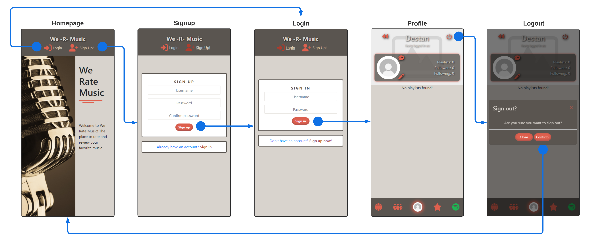
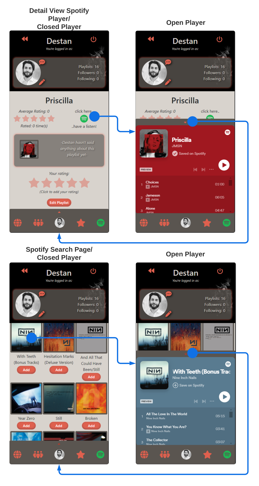

# We Rate Music

## Project Goals

- Talk about combining both DRF and React
- Bringing users together
- Intentions for the future

[HEROKU LINK](https://we-rate-music-react-f931068bb6db.herokuapp.com/)

## Table of Contents

1. [Planning](#planning)

- [User Stories](#user-stories)
- [Wireframes, Fonts & Colours](#wireframes-fonts--colours)
- [Database Modeling](#database-modeling)
- [Agile Development](#agile-development)

2. [Django Rest Framework](#django-rest-framework)

- [The Database](#the-database)
- [Feedback](#feedback)
- [Profile](#profile)
- [Playlist](#playlist)
- [Rating](#rating)
- [Follower](#follower)
- [API Endpoints](#api-endpoints)

3. [Frontend React Application](#frontend-react-application)

- [Workflows](#workflows)

- [API](#api)

  - [AxiosDefaults](#axiosdefaults)

- [Components](#components—features)

  - [AccordionWindow](#accordionwindow)
  - [Avatar](#avatar)
  - [LoadingSpinner](#loadingspinner)
  - [ModalWindow](#modalwindow)
  - [NavBar](#navbar)
  - [Playlist](#playlist)
  - [Profile](#profile)
  - [SearchBar](#searchbar)
  - [SignOutButton](#signoutbutton)
  - [StarRating](#starrating)

- [Contexts](#contexts)

  - [CurrentUserContext](#currentusercontext)
  - [SpotifyPlayerUriContext](#spotifyplayeruricontext)

- [Forms](#forms)

  - [FeedbackCreateForm](#feedbackcreateform)
  - [PlaylistEditForm](#playlisteditform)
  - [ProfileEditForm](#profileeditform)

- [Hooks](#hooks)

  - [useRedirect](#useredirect)

- [Pages](#pages)

  - [Auth](#auth)
    - [SignInForm](#signinform)
    - [SignUpForm](#signupform)
  - [Homepage](#homepage)
  - [PageNotFound404](#pagenotfound404)
  - [PlaylistDetail](#playlistdetail)
  - [PlaylistsPage](#playlistspage)
  - [ProfilePage](#profilepage)
  - [SpotifySearchPage](#spotifysearchpage)

- [Spotify](#spotify)

  - [AddPlaylistButton](#addplaylistbutton)
  - [SpotifyPlayer](#spotifyplayer)
  - [SpotifySearchPage](#spotifysearchpage)
  - [useSpotifyAuth](#usespotifyauth)

4. [Future Features/Roadmap](#future-featuresroadmap)

5. [Testing](#testing)

6. [Challenges & Bugs](#challenges—bugs)

7. [Technologies Used](#technologies-used)

   - [Frameworks, libraries, and dependencies](#frameworks—libraries—and-dependencies)

8. [Deployment](#deployment)

9. [Creating the Heroku app](#creating-the-heroku-app)

10. [Development](#development)

11. [Credits](#credits)

## Planning

### User Stories

1. As a user I can navigate the app using a “social media style navbar” so that I can easily navigate between pages.
2. As a user I can navigate through pages quickly and seamlessly without the annoying page refresh.
3. As a user I can create a new account so that I can access all features for signup up users.
4. As a user I can sign in to the app so that I can access functionality for logged in users.
5. As a logged out user I see different navigation elements to when I’m logged in for a better user experience.
6. As a user I can remain logged in until I choose to log out so my experience on the app isn’t cut short unnecessarily.
7. As a user I can view user’s avatars so that I can easily identify users of the application and see my own avatar in the profile tab.
8. As a user I can authorise the application to use my Spotify credentials so that I can benefit from using all the extra features the app provides.
9. As a user I can search for playlists/albums and artists on Spotify without leaving the application.
10. As a user I can listen to the playlists/albums that are returned from my search, so that I can decide if I like them or not, plus the added convenience of not leaving the application.
11. After searching for playlists on Spotify, as a user, I can decide to add certain playlists/albums to my profile so that other users can view my personalised selection of playlists and rate them.
12. As a user I can edit my playlists from within the app, such as the name and album artwork, and have the app update my Spotify account for me so that the change is reflected on Spotify too.
13. As a user I can minimise the Spotify player, continue listening to music while still enjoying browsing other playlists.
14. As a user I can continue browsing the entire app while listening to playlists uninterrupted.
15. As a user I can view my profile so that I can view all the playlists I’ve added in one place.
16. As a user I can click on a playlist to view its details, so that I may see its average rating for example.
17. As a user I can view playlists I have already rated, so that I can update them and more importantly have a section of the app dedicated to playlists I have likely enjoyed.
18. As a user I can view other users’ profiles so that I can see their collection of playlists and listen to them.
19. As a user I can follow other users so that I can more easily keep track of playlists they add.
20. As a user I get notified when I have a new follower, so that I am aware and can potentially follow them back.
21. As a user I can send private message to other users I follow, so that I can stay in touch with other users and comment privately to them.
22. As a user I can view all the most recent playlist submissions by other users so that I can stay up to date with the newest content.
23. As user I can keep scrolling through playlists without the need to click the next page, this would be far better for my user experience.
24. As a user I can sort the rated playlist view in order of score given to ratings, so that my higher rated playlists appear higher up in the view.
25. As a user I want to be able to rate my own and other users' playlists, so that I can express my opinion on them.
26. As a user I can update my already existing ratings so that I can change my mind at a later time and increase or decrease a playlists score.
27. As a user I can delete a rating I have submitted in the past, so that it doesn't appear in my '/rated-playlists' feed.
28. As a user, I'd like to be able to update playlists in my profile so that I can change their name and add a small description about them. That way I can express why I chose to add the playlist and say a little about what occasions the playlists are best for.
29. As a user, I can view some basic statistics in profiles, such as the number of playlists belonging to the profile, the number of users the profile is following and the number of users following the profile.
30. As a user, I can edit my profile image and the background image, so that I can personalise my profile view for myself and others to see.
31. As a user I'd like to be able to search for other user so that I can view their profiles and potentially follow them.
32. As a user, I'd like to have a smoother experience when using the search bar to search for users, so that I have a better experience using the app more generally.
33. As a user, I'd like to be able to sign out of the application so that my is secure when I am away from my computer.
34. As a user, I can send feedback to the site owner, so that I can share with them my experiences with the app and hopefully use my input to improve my experiences further.
35. As a site owner, I can view the feedback and suggestions submitted by my users so that I can improve the user experience further, and pick up on bugs faster.

  <a href="#">Back to the top</a>

### Wireframes, Fonts & Colours

The wireframe for the Profile page was created using Procreate on an iPad. This wireframe was used just as a rough guide for the initial designs of the app.

The font used in this app is "Anta" (default font: sans-serif). Downloaded from Google Fonts.

The colour scheme for the app was chosen using [colormind.io](http://colormind.io/). The brown and red colours were chosen to give the app a warm and inviting feel, with the light beige colour being primarily used for the background of the app.

  <a href="#">Back to the top</a>

### Database Modeling

Lucidchart was used to create the database model for the project. The database is made up of five custom models: Profile, Playlist, Rating, Follower, and Feedback:

### Agile Development

The project was developed using the Agile methodology. The project was broken down into epics, with each epic lasting roughly a week. The project was developed in 6 epics.

You can view the project's Kanban board [here](https://github.com/users/DestanT/projects/5/views/2)
You can view the project's Milestones and Epics board [here](https://github.com/users/DestanT/projects/5/views/4)
You can view the project's Monthly Roadmap view [here](https://github.com/users/DestanT/projects/5/views/1)

  <a href="#">Back to the top</a>

## Django Rest Framework

Django Rest Framework API serves as the backend to the React frontend application. The API endpoints were designed with the user stories for the whole project in mind, which can be found [here](#user-stories). PostgreSQL manages the databases and serves the data.

### The Database

#### User Model

The user model is a default model provided by Django all-auth. It includes the following fields:

#### Profile Model

The profile model is a custom model that extends the default user model. It includes the following fields:

- ‘owner’: OneToOneField with the User model
- ‘created_at’: Automatically generated DateTimeField
- ‘image’: ImageField to store the user’s profile picture to Cloudinary
- ‘background’: ImageField to store the user’s profile background to Cloudinary

#### Playlist Model

The playlist model is a custom model that includes the following fields:

- ‘spotify_id’: CharField
- ‘owner’: ForeignKey with the Profile model
- ‘added_on’: Automatically generated DateTimeField
- ‘title’: CharField
- ‘description’: TextField
- ‘image’: ImageField to store the playlist’s cover art to Cloudinary
- ‘url’: URLField
- ‘iframe_uri’: CharField

#### Rating Model

The rating model is a custom model that includes the following fields:

- ‘owner’: ForeignKey with the Profile model
- ‘playlist’: ForeignKey with the Playlist model
- ‘score’: PositiveSmallIntegerField, with a range of 1-10 (although the frontend only allows for 1-5 currently)
- ‘created_at’: Automatically generated DateTimeField
- ‘updated_at’: Automatically generated DateTimeField

#### Follower Model

The follower model is a custom model that includes the following fields:

- ‘owner’: ForeignKey with the Profile model
- ‘followed’: ForeignKey with the Profile model
- ‘created_at’: Automatically generated DateTimeField

#### Feedback Model

The feedback model is a custom model that includes the following fields:

- ‘user’: ForeignKey with the User model
- ‘title’: CharField
- ‘feedback’: TextField
- ‘image’: ImageField to store the user’s feedback image to Cloudinary
- ‘created_at’: Automatically generated DateTimeField

### API Endpoints

The following API endpoints were created to serve the React frontend application:

- '' - The root endpoint, which redirects to index.html/homepage.
- 'admin/' - The Django admin panel.
- 'api/api-auth/' - The Django Rest Framework authentication endpoint.
- 'api/dj-rest-auth/logout/' - Custom logout endpoint (known issue with dj-rest-auth own logout endpoint).
- 'api/dj-rest-auth/' - The Django Rest Framework authentication endpoint.
- 'api/dj-rest-auth/registration/' - The Django Rest Framework registration endpoint.
- 'api/profiles/' - The Profile model endpoint.
- 'api/profiles/:pk' - The Profile model's detail view endpoint.
- 'api/playlists/' - The Playlist model endpoint.
- 'api/playlists/:pk' - The Playlist model's detail view endpoint.
- 'api/ratings/' - The Rating model endpoint.
- 'api/ratings/:pk' - The Rating model's detail view endpoint.
- 'api/followers/' - The Follower model endpoint.
- 'api/followers/:pk' - The Follower model's detail view endpoint.
- 'api/feedback/' - The Feedback model endpoint.
- 'api/feedback/:pk' - The Feedback model's detail view endpoint.

  <a href="#">Back to the top</a>

## Frontend React Application

### Workflows

The following workflows were created to serve the user stories for the React frontend application:

- User Authentication: The user can sign up, sign in, and sign out of the application.

- Searching for and Following Other Users: The user can search for other users and follow them.

- Playlist Detail and Rating: The user can view and rate playlists.

- Editing Profile image and background: The user can edit their profile image and background.

- Spotify Authentication and Adding Playlists: The user can authenticate their Spotify account and add playlists to their in-app profile.

- Using the Spotify Player: The user can use the Spotify player to listen to music while browsing the app.

  <a href="#">Back to the top</a>

### API

#### AxiosDefaults

This file sets up Axios, a tool for HTTP requests in web apps, with '/api' as the base URL for simplicity. Two Axios instances are exported for request and response handling.

  <a href="#">Back to the top</a>

### /Components

#### AccordionWindow

**Overview**
The AccordionWindow component is used as a container for the Spotify player, which is hidden just above the NavBar component until needed. It’s designed to be a clean and unobtrusive way to let users listen to music while browsing the app.

**Props**
This component doesn’t need any specific props to function. It uses the Spotify player URI context provider to activate itself.

**Key Features**

- Houses the SpotifyPlayer component
- Uses the useSpotifyPlayerUri hook - when the user clicks on a playlist, the Spotify player URI is updated and the player is displayed.
- FontAwesomeIcon: An arrow icon that changes direction when the accordion is opened or closed.

#### Avatar

**Overview**
The Avatar component is designed to show users' profile pictures. It is used in many parts of the app, such as the NavBar and the Profile page. It provides a visual representation of the users' uploaded images and makes the app feel more personal.

**Props**

- src (required): The source URL for the avatar image.
- height in px (optional): Default size is 45 pixels.

#### LoadingSpinner

**Overview**
The LoadingSpinner component displays a spinning disc icon, enhancing the user experience by providing visual feedback while waiting for other components to load. Used all across the app in ternary operators to display the spinner while the app is fetching data.

**Props**
This component doesn’t need any specific props to function.

**Key Features**

- FontAwesome Icon: Uses the faCompactDisc to go with the music theme of the app.

#### ModalWindow

**Overview**
The ModalWindow component acts as a pop-up confirmation window that appears when triggered. It is used throughout the app to confirm more crucial actions, such as deleting a playlist or being redirected to the Spotify authentication page. Just in case it was a misclick by the user.

**Props**
It is recommended to use the following props to make use of the ModalWindow component, and parent components using this component should also manage the showModal and setShowModal states:

- title (string): The text title is displayed at the top of the modal.
- body (any): The main content of the modal, which can be text, an image, or JSX.
- onHide: The function to close the modal, by making a function call to setModalShow(false) from its parent component.
- onConfirm: A function that is passed from the parent component, typically used to confirm the users' action.

**Key Features**

- Customisable title and body.
- 2 customisable buttons: "Close" and "Confirm".

#### NavBar

**Overview**
The NavBar component is the main navigation method for the user to move around the application's various features. It is displayed right from the start of the users' experience with the app.

**Props**
This component doesn’t need any specific props to function.

**Key Features**

- Dynamic: Icons and NavBar placement change based on the user's authentication status and the current page.

#### Playlist

**Overview**
The Playlist component shows the cover art for playlists. As well as being very similar to the Avatar component, it is also used in many parts of the app, such as the Profile page and the various user feeds. It provides a visual representation of the playlists and makes the users' profiles feel more personal.

**Props**

- image (string): The URL of the playlist image. Typically from the database or the Spotify API.
- title: The title of the playlist, which is used to generate a descriptive alt text for the image, enhancing accessibility.

**Key Features**

- Default Image: Uses a default image when no specific playlist image is supplied, preventing any visual gaps or errors in the UI.

#### Profile

**Overview**
The Profile component is designed to be an interactive hub for users to view information about their own and other users' profiles. It currently handles the logic for other crucial features such as following and unfollowing other users and checking the screen size the user is currently using to display the correct layout.

**Props**

- userId (string): Fetches the profile data from the backend using the user ID.

**Key Features**

- Responsive Design: Adapts to different screen sizes.
- Profile Data Fetching: Fetches and displays user-specific information, such as the number of followers, the number of followed users, and added playlists.

**Functionalities**

- Back Button: Takes the user back to the previous page.
- Signout Button: Allows the user to sign out of the application.
- Feedback Button: Takes the user to the FeedbackCreateForm page.
- Follow/Unfollow: Allows users to follow or unfollow other users.
- Edit Profile Button: Takes the user to the ProfileEditForm page.

#### SearchBar

**Overview**
The SearchBar component is a versatile React element designed for implementing search functionality within a web application. It enables users to type in search queries and interact with search results dynamically displayed in a dropdown menu. The component is built to accommodate both live search scenarios, where results are fetched and displayed as the user types, and traditional search forms that require submission. It leverages React Bootstrap for form and input styling, FontAwesome for visual elements, and custom hooks for API requests.

**Props**

- onSearch: Custom function passes to the component that is executed when the user submits a search query. Currently only used in the SpotifySearchPage component.
- liveSearch: Defaults to false.

**Key Features**

- Live Search: Allows users to search for and dynamically display results as they type in their query.
- Infinite Scroll: Integrates the InfiniteScroll component within the dropdown results, enhancing user experience by loading more results only as needed.

#### SignOutButton

**Overview**
The SignOutButton component is a button that sends a post request to the "dj-rest-auth/logout" endpoint and logs the user out of the application. It is currently used in the Profile component.

**Props**
This component doesn’t need any specific props to function.

**Key Features**

- Confirmation Modal: Incorporates a ModalWindow component to display a confirmation modal, confirming the user's intention to signing out.
- Redirect on Sign-Out: Navigates users back to the homepage after successfully signout.
- Local Storage: Removes potentially sensitive data from local storage when the user signs out.

#### StarRating

**Overview**
The StarRating component allows users to rate their own and other users' playlists. It is currently only used in the PlaylistDetail component. It is meant as a way to express the users' opinions on playlists, that they or others have added to the app.

**Props**

- playlist: The playlist state from the PlaylistDetail component.
- setPlaylist: The setPlaylist state from the PlaylistDetail component.

**Key Features**

- Dynamic Rating Updates: Users get immediate visual feedback when assigning their ratings. The average rating and the number of ratings are updated in real-time.

  <a href="#">Back to the top</a>

### /Contexts

#### CurrentUserContext

**Overview**
The CurrentUserContext serves as a context provider for the currently logged-in user's data. It is currently wrapped around App.js in the index.js file.

**Key Features**

- User Data: Fetches and stores the current user's data.
- Axios Interceptors: Uses Axios interceptors to check for expired tokens and refresh them, keeping the user logged in for longer.

#### SpotifyPlayerUriContext

**Overview**
The SpotifyPlayerUriContext is the context provider designed to hold and update the Spotify Player's URI across the application. It is currently wrapped around App.js in the index.js file.

**Key Features**

- Seemless Playback: Allows the user to continue listening to the same playlist across the app, and activate the Spotify player in various parts of the app.

  <a href="#">Back to the top</a>

### /Forms

#### FeedbackCreateForm

**Overview**
FeedbackCreateForm page allows the user to submit feedback to the site owners. It is designed to be a direct channel between users and the site owners, for faster development and improvement of the app. Django Rest Framework's admin panel can be used to view the feedback. Future implementations should involve a better management system for feedback as the app grows.

#### PlaylistEditForm

**Overview**
PlaylistEditForm page allows users to edit the title and description of the playlists in their profile. It gives users a way to communicate, a little more personally, how they feel about their playlists. The form also allows users to delete unwanted playlists from their profiles.

**Key Features**

- Owner Checking: Ensures that only the owner of the playlist can make edits.

#### ProfileEditForm

**Overview**
ProfileEditForm page allows users to update their profile and background images. This allows users to personalise their profiles, enhancing the user experience even further.

**Key Features**

- Owner Checking: Ensures that only the owner of the playlist can make edits.
- Upload Sizes: Limits of 4096px by 4096px and 2mb, set by the backend.

  <a href="#">Back to the top</a>

### /Hooks

#### useRedirect

**Overview**
useRedirect is a custom React hook designed to redirect users based on their authentication status. As the app is designed to be only used by authenticated users, this hook is used across the app to ensure that users are always redirected if not properly authenticated.

  <a href="#">Back to the top</a>

### /Pages

#### /Auth

##### SignInForm

**Overview**
The SignInForm page provides a user interface for signing into the web application. Upon successful authentication, the user is redirected to their profile page. A token timestamp, which is used in the currentUserContext.js file.

##### SignUpForm

**Overview**
The SignUpForm page provides a user with an interface for creating an account. Upon successful account creation, the user is redirected to the sign-in page.

#### Homepage

**Overview**
The Homepage component serves as the landing page for the "We Rate Music" application. It is designed to be minimalistic and it provides a small introduction to the purpose of the app.

#### PageNotFound404

**Overview**
The PageNotFound404 component displays a custom 404 error page, indicating that the requested page is not found. It includes a button that redirects the user back to the homepage.

#### PlaylistDetail

**Overview**
The PlaylistDetail component is dedicated to handling all the logic of individual playlists. It displays the playlist's title, average rating, the owner's rating and description, and the number of times it has been rated in total. It also includes the Spotify logo, which allows users to update the Spotify player URI and activate the Spotify player.

**Key Features**

- Data Fetching: Retrieves the data about the playlist based on the ID from the URL.
- Ratings / Dynamic Updates: Allows users to rate the playlist and dynamic updates that calculate the average rating.
- Dynamic Description Box: Displays a default text if the playlist owner has not added a description, will display the description if the owner has added one with the owner's name as the author, and finally will also display the owner's own rating of the playlist, if they have rated it.
- Edit Button: Appears if the user is also the owner of the playlist.

#### PlaylistsPage

**Overview**
The PlaylistsPage is designed to display a collection of playlists based on its filter property. It is used in "/global", "/feed", "/rated-playlists", and "/profile" routes.

**Props**

- filter (string): The filter used to fetch playlists from the backend. Defaulted to "all".
- profileView (boolean): Defaulted to false, if true, the component will have a padding-top property set to account for the Profile component's height.

**Key Features**

- Data Fetching: Fetches playlists based on the filter property.
- Dynamic No Data Message: Displays a message if no playlists are found based on the filter property.
- Infinite Scroll: Utilises the InfiniteScroll component to load more playlists as the user scrolls down the page.

#### ProfilePage

**Overview**
The ProfilePage's current only purpose is to get the user's profile ID from the URL and pass it on to the Profile and PlaylistsPage components to dynamically display the viewed user's profile and playlists.

  <a href="#">Back to the top</a>

### /Spotify

#### AddPlaylistButton

**Overview**
The AddPlaylistButton component is designed to let users add a playlist from Spotify to their in-app profile. It is currently only used in SpotifySearchPage.js.

**Props**

- playlistData (object): The playlist data fetched from the Spotify API.

**Key Features**

- Confirmation Modal: Utilizes the ModalWindow component to confirm before finally adding the playlist.

#### SpotifyPlayer

**Overview**
The SpotifyPlayer component sits within the AccordionWindow component and is designed to display the Spotify iFrame player. When the app is first loaded the script is run to inject the Spotify iFrame API, and the player remains hidden until it is triggered by the SpotifyPlayerUriContext provider.

The source for the code can be found in the [Spotify Web Developer](https://developer.spotify.com/documentation/embeds/tutorials/using-the-iframe-api) documentation.

**Key Features**

- Unique Resource Identifier: It uses Spotify's URI data from playlists to play the correct playlist.

#### SpotifySearchPage

**Overview**
The SpotifySearchPage facilitates the connection between the user's Spotify account and the "We Rate Music" application. It allows users to search for playlists and add them to their in-app profile via the AddPlaylistButton component. It displays search results similar to the PlaylistsPage component.

**Key Features**

- Spotify Authentication: Redirects users to the Spotify authentication page to log in and authorise the app.
- Locally Stored Searches: Caches the last search result in local storage. Will only overwrite the last search if the new search brings back results.
- Access and Refresh Tokens: Stores the user's access and refresh tokens in local storage and refreshes them with every search.

**Key Notes**
When the user is first redirected back to the app after authorising the app, the component will wait 1000ms before attempting to get the access token from local storage. Not applying this meant that the user was greeted with another modal window asking them to authorise the app again.

#### useSpotifyAuth

**Overview**
The useSpotifyAuth is a custom React hook that facilitates the authentication process with Spotify, utilizing the Proof Key for Code Exchange (PKCE) flow.

More details and the source for the code can be found in the [Spotify Web Developer](https://developer.spotify.com/documentation/web-api/tutorials/code-pkce-flow) documentation.

  <a href="#">Back to the top</a>

### /Utils

#### dataUtils

**Overview**
This is a collection of utility functions that are used across the app to manage and manipulate data.

##### Functions

**fetchMoreData**

This function is used in the InfiniteScroll component to fetch more data as the user scrolls down a page.

**setTokenTimestamp, shouldRefreshToken, and removeLocalStorageItems**

These functions are used in the currentUserContext.js file to manage the user's token timestamp and keep the user logged in for longer. The removeLocalStorageItems function is used in the SignOutButton component, it removes potentially sensitive data from local storage when the user signs out.

**calculateAverageRatingPUT and calculateAverageRatingPOST**

These functions are used in the PlaylistDetail component to calculate the average rating of a playlist based on whether the user is updating or creating a new rating.

#### spotifyAuthUtils

**Overview**
This is a collection of utility functions provided by Spotify to facilitate user authentication with the Spotify Web API.

More details and the source for the code can be found in the [Spotify Web Developer](https://developer.spotify.com/documentation/web-api/tutorials/code-pkce-flow) documentation.

  <a href="#">Back to the top</a>

## Future Features/Roadmap

- **Private Messaging**: Allow users to send private messages to other users.
- **Expanded Profile Statistics**: Display more detailed statistics in profiles, such as the number of playlists a user has rated and what a user's average given rating is.
- **Improved Feedback System**: Allow site owners to reply to feedback and suggestions and sort feedback by a variety of different filters.
- **Improved Spotify API Functionality**: More data, means more features. Users should be able to feel confident that they can follow a user based on their music taste, and not just their playlists. So the addition of genres and average rating given per genre would be a great addition.
- **Improved Performance**: As the app grows its user base, optimisations will be needed to keep the app running smoothly.
- **Smaller Components**: Currently some components handle too much logic on their own, splitting the component logic into smaller chunks will make the app easier to maintain and improve.

  <a href="#">Back to the top</a>

## Testing

Please click [here](https://github.com/DestanT/we_rate_music_react_drf/blob/main/TESTING.md) to see all the testing that was done for this project.

## Challenges & Bugs

- **Spotify API**: The Spotify API was a challenge to work with due to the need for user authentication and the complexity of the API itself, it didn't help that the documentation had a couple of typos in it!
- **Spotify Authentication and Redirecting back to the app**: One issue seemed to be components being unmounted and while Spotify was redirecting the user back to the app, the app would throw an error. This was solved by using an AbortController and a cleanup function.
- **Spotify Player**: Strangely the Spotify player is very temperamental. During development, it would work seamlessly, but when it came to testing it on different devices, it would sometimes not work at all. Some devices had more issues than others. This is in fact still an ongoing issue and a solution to this problem is still being sought after.
- **SpotifyPlayer Component**: Currently as it stands the SpotifyPlayer component works as intended, however, one minor issue is when the player is minimised and the user clicks on the same playlist again, the player will not maximise again. This seems to be a minor issue and a fix will be implemented as soon as possible. It is more of a quality-of-life issue than a bug.
- **Profile Edit Form**: When the user is updating their profile image and or background image, the form will not update the image until the user refreshes the page. This was a bigger issue to try and fix than first thought, and the problem was ignored for the time being. In hindsight, a data context provider should have been used, and will most probably be implemented in the next big update.

  <a href="#">Back to the top</a>

## Technologies Used

- Python 3.12.1
- Django 3.2.23
- Django Rest Framework 3.14.0
- React 17.0.2

### Frameworks, libraries, and dependencies

- React (react, react-dom): Used to build the frontend application, providing a component-based architecture for building user interfaces.
- React Router DOM (react-router-dom): DOM bindings for React Router, enabling dynamic routing in a web app, allowing you to create navigable components in your React application.
- Axios (axios): A promise-based HTTP client for the browser and Node.js, making it easy to send asynchronous HTTP requests to REST endpoints and perform CRUD operations.
- Bootstrap (bootstrap): An open-source toolkit for developing with HTML, CSS, and JS, providing design templates for typography, forms, buttons, navigation, and other interface components.
- React Bootstrap (react-bootstrap): Integrates Bootstrap with React, replacing Bootstrap's JavaScript with React components without relying on jQuery.
- JWT Decode (jwt-decode): A library to decode JSON Web Tokens (JWT) in client-side applications, useful for extracting user details or other payload information from tokens.
- React Infinite Scroll Component (react-infinite-scroll-component): A component to easily implement infinite scrolling in React applications, enhancing performance and user experience in long lists or feeds.
- Font Awesome Icons (@fortawesome): Provides scalable vector icons that can be customized with the power of CSS for React applications, including free brands, and regular, and solid icons.
- React Rating (@smastrom/react-rating): A customizable rating component for React, allowing users to provide ratings in applications, such as product reviews or feedback systems.

  <a href="#">Back to the top</a>

## Deployment

You can view the application on Heroku by clicking [here](https://we-rate-music-react-f931068bb6db.herokuapp.com/).

**Creating the Heroku app**
Before creating the Heroku app, and within your project:

1. Make sure you have a file named “requirements.txt” in your main project folder.
2. Open the command line and navigate to your project folder.
3. Run the command “pip3 freeze > requirements.txt”.
   - This will create a list of dependencies used in the project for Heroku to set up the environment later.
4. Create a "Procfile" in the project's main directory with "release: python manage.py makemigrations && python manage.py migrate" on one line and "web: gunicorn we_rate_music_drf.wsgi" in the second line - this allows Heroku to properly configure to a gunicorn web app.
5. In the project's settings.py file configure the ALLOWED_HOSTS list to include 'your_app_name123.herokuapp.com'.
6. Push these latest changes, including the requirements.txt file, to your GitHub repository (or any other preferred Git service).

**Spotify for Developers:**

1. Login to your Spotify account on [Spotify for Developers](https://developer.spotify.com/) or create a free account first.
2. Go to your Dashboard.
3. Click on "Create app".
4. Give the app a name, description, and a redirect URI of your local host.
5. For "Which API/SDKs are you planning to use?" - select Web API.
6. Agree to the terms and conditions (preferably read them first!).
7. Back on your Dashboard; select the app you just made and click "Settings".
8. Take note of your Client ID and Client Secret (do not share this!). Client ID will be used in the frontend.

**Cloudinary:**

1. Create a free account on [Cloudinary](https://www.cloudimage.io/en/home).
2. Find the "Settings" tab.
3. From here, click "Access Keys".
4. Take note of your API Key and API Secret (again, do not share!).

**ElephantSQL:**

As Django's internal database system would reset every time Heroku refreshes your app while idle, it is best to use a service like [ElephantSQL](https://www.elephantsql.com/).

1. Create a free account.
2. From the "Instances" dashboard - Create a New Instance.
3. Name your app, and choose your tier (free is okay for now).
4. Select the closest server to your region.
5. Click "Create instance".
6. Back on your Dashboard - select the newly created instance
7. Under "Details" copy the URL field (not to be shared!)

**Now, you can proceed with creating the Heroku app:**

1. Sign in to your Heroku account (if you don’t already have one, create a free account on [Heroku](https://www.heroku.com/) first).
2. Once logged in, click on the “Create new app” button on your Heroku dashboard and follow the subsequent steps.
3. From within your newly created app, click the “Settings” tab.
4. Scroll down to the section labeled “Config Vars” and click on “Reveal Config Vars”.
5. Configure the following key-value pairs:
   - ALLOWED_HOST: your_app_name123.herokuapp.com - (no https:// or / at the end)
   - CLIENT_ORIGIN: https://your_app_name123.herokuapp.com - (with https:// and no / at the end)
   - CLOUDINARY_URL: The format of this URL is as follows - 'cloudinary://{Your API KEY}:{Your API Secret}'
   - DATABASE_URL: This is your ElephantSQL URL
   - SECRET_KEY: This is your Django project's secret key
   - DISABLE_COLLECTSTATIC: 1
6. Navigate to the “Deploy” tab at the top of the page.
7. Choose your preferred deployment method (GitHub, for example) and connect it to your app.
8. Search for the repository name in the dropdown menu and select it.
9. Click “Connect”.
10. Then, either select “Enable Automatic Deploys” or “Deploy Branch”; the difference is that one automatically deploys the app every time a change is pushed to GitHub and the other needs to be redeployed manually every time.
11. You should now have a working Heroku app on your dashboard.

  <a href="#">Back to the top</a>

## **Development**

If you would like to contribute to this project, please follow the following steps:

From GitHub:

1. Create a separate branch for your development work
2. Make any necessary modifications and improvements to the project on your branch.
3. Create a pull request with a clear and detailed description of the changes you have made.
4. I will review your changes and provide feedback if needed.
5. If everything looks good, I will merge the changes into the main branch of the project.

If you wish to use any parts of the project for your project, you are welcome to do so. However, please give credit to me by linking my GitHub profile.

Thank you for your interest in the project, and I look forward to any contributions or acknowledgments!

  <a href="#">Back to the top</a>

## **Credits**

- A lot of initial code inspiration came from Code Institute's "Moments" walkthrough project and this is credited directly in the code.
- [Cosden Solutions - Youtube](https://www.youtube.com/@cosdensolutions)

### **Content**

- [Django Rest Framework Documentation](https://www.django-rest-framework.org/)
- [React Bootstrap Documentation](https://react-bootstrap-v4.netlify.app/)
- [React Router Documentation](https://reactrouter.com/en/main)
- [Bootstrap 4 Documentation](https://getbootstrap.com/docs/4.6/getting-started/introduction/)
- [Spotify API Documentation](https://developer.spotify.com/documentation/web-api)
- [Stack Overflow](https://stackoverflow.com/) - general enquiries/syntax
- [W3Schools](https://www.w3schools.com/) - general enquiries/syntax
- [Star Rating Component](https://www.npmjs.com/package/@smastrom/react-rating/v/1.3.1?activeTab=readme)
- [Infinite Scroll Component](https://www.npmjs.com/package/react-infinite-scroll-component)
- [JWT Decode](https://www.npmjs.com/package/jwt-decode)
- [Font Awesome Icons](https://fontawesome.com/)

  <a href="#">Back to the top</a>

