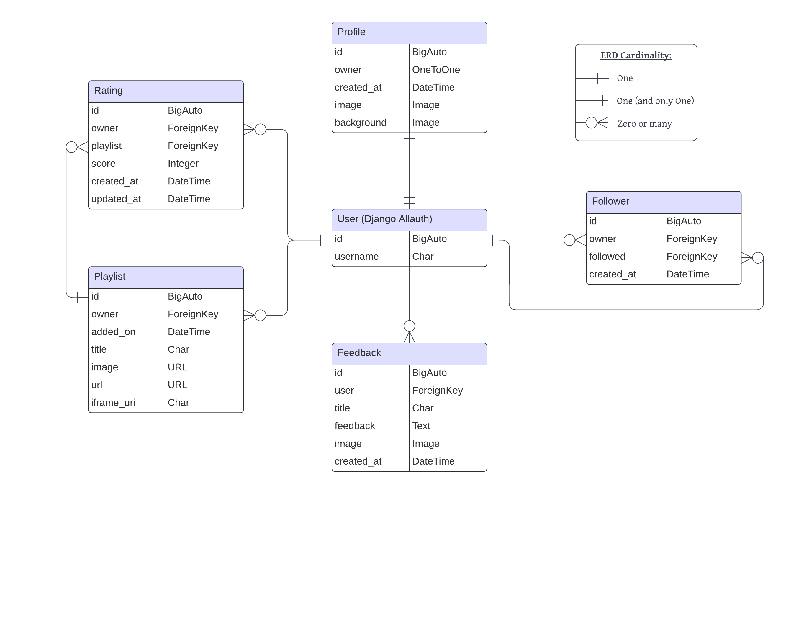

# We Rate Music

## Project Goals

- Talk about combining both DRF and React
- Bringing users together
- Intentions for the future

[HEROKU LINK](https://we-rate-music-react-f931068bb6db.herokuapp.com/)

## Table of Contents

1. [Planning](#planning)

- [User Stories](#user-stories)
- [Wireframes](#wireframes)
- [Database Modeling](#database-modeling)
- [Agile Development](#agile-development)

2. [Django Rest Framework](#django-rest-framework)

- [Database Modeling](#database-modeling)
- [Feedback](#feedback)
- [Profile](#profile)
- [Playlist](#playlist)
- [Rating](#rating)
- [Follower](#follower)
- [API Endpoints](#api-endpoints)

3. [Frontend React Application](#frontend-react-application)

- [Workflows](#workflows)

- [API](#api)

  - [AxiosDefaults](#axiosdefaults)

- [Components](#components—features)

  - [AccordionWindow](#accordionwindow)
  - [Avatar](#avatar)
  - [LoadingSpinner](#loadingspinner)
  - [ModalWindow](#modalwindow)
  - [NavBar](#navbar)
  - [Playlist](#playlist)
  - [Profile](#profile)
  - [SearchBar](#searchbar)
  - [SignOutButton](#signoutbutton)
  - [StarRating](#starrating)

- [Contexts](#contexts)

  - [CurrentUserContext](#currentusercontext)
  - [SpotifyPlayerUriContext](#spotifyplayeruricontext)

- [Forms](#forms)

  - [FeedbackCreateForm](#feedbackcreateform)
  - [PlaylistEditForm](#playlisteditform)
  - [ProfileEditForm](#profileeditform)

- [Hooks](#hooks)

  - [useRedirect](#useredirect)

- [Pages](#pages)

  - [Auth](#auth)
    - [SignInForm](#signinform)
    - [SignUpForm](#signupform)
  - [Homepage](#homepage)
  - [PageNotFound404](#pagenotfound404)
  - [PlaylistDetail](#playlistdetail)
  - [PlaylistsPage](#playlistspage)
  - [ProfilePage](#profilepage)
  - [SpotifySearchPage](#spotifysearchpage)

- [Spotify](#spotify)

  - [AddPlaylistButton](#addplaylistbutton)
  - [SpotifyPlayer](#spotifyplayer)
  - [SpotifySearchPage](#spotifysearchpage)
  - [useSpotifyAuth](#usespotifyauth)

4. [Future Features/Roadmap](#future-featuresroadmap)

5. [Testing](#testing)

- [Lighthouse Testing](#lighthouse-testing)
- [W3C Markup Validation](#w3c-markup-validation)
- [W3C CSS Validation](#w3c-css-validation)
- [JS Hint](#js-hint)
- [Pylint-Django](#pylint-django)
- [Automated Testing](#automated-testing)
- [Manual Testing](#manual-testing)

6. [Challenges & Bugs](#challenges—bugs)

7. [Technologies Used](#technologies-used)

   - [Frameworks, libraries, and dependencies](#frameworks—libraries—and-dependencies)

8. [Deployment](#deployment)

9. [Creating the Heroku app](#creating-the-heroku-app)

10. [Development](#development)

11. [Credits](#credits)

## Planning

### User Stories

### Wireframes

### Database Modeling

Lucidchart was used to create the database model for the project. The database is made up of five custom models: Profile, Playlist, Rating, Follower, and Feedback:

### Agile Development

The project was developed using the Agile methodology. The project was broken down into epics, with each epic lasting roughly a week. The project was developed in 6 epics.

You can view the projects Kanban board [here](https://github.com/users/DestanT/projects/5/views/2)
You can view the projects Milestones and Epics board [here](https://github.com/users/DestanT/projects/5/views/4)
You can view the projects Monthly Roadmap view [here](https://github.com/users/DestanT/projects/5/views/1)

## Django Rest Framework

Django Rest Framework API serves as the backend to the React frontend application. The API endpoints were designed with the user stories for the whole project in mind, which can be found [here](#user-stories). PostgreSQL manages the databases and serves the data.

### The Database

#### User Model

The user model is a default model provided by Django all-auth. It includes the following fields:

#### Profile Model

The profile model is a custom model that extends the default user model. It includes the following fields:

- ‘owner’: OneToOneField with the User model
- ‘created_at’: Automatically generated DateTimeField
- ‘image’: ImageField to store the user’s profile picture to Cloudinary
- ‘background’: ImageField to store the user’s profile background to Cloudinary

#### Playlist Model

The playlist model is a custom model that includes the following fields:

- ‘spotify_id’: CharField
- ‘owner’: ForeignKey with the Profile model
- ‘added_on’: Automatically generated DateTimeField
- ‘title’: CharField
- ‘description’: TextField
- ‘image’: ImageField to store the playlist’s cover art to Cloudinary
- ‘url’: URLField
- ‘iframe_uri’: CharField

#### Rating Model

The rating model is a custom model that includes the following fields:

- ‘owner’: ForeignKey with the Profile model
- ‘playlist’: ForeignKey with the Playlist model
- ‘score’: PositiveSmallIntegerField, with a range of 1-10 (although the frontend only allows for 1-5 currently)
- ‘created_at’: Automatically generated DateTimeField
- ‘updated_at’: Automatically generated DateTimeField

#### Follower Model

The follower model is a custom model that includes the following fields:

- ‘owner’: ForeignKey with the Profile model
- ‘followed’: ForeignKey with the Profile model
- ‘created_at’: Automatically generated DateTimeField

#### Feedback Model

The feedback model is a custom model that includes the following fields:

- ‘user’: ForeignKey with the User model
- ‘title’: CharField
- ‘feedback’: TextField
- ‘image’: ImageField to store the user’s feedback image to Cloudinary
- ‘created_at’: Automatically generated DateTimeField

### API Endpoints

The following API endpoints were created to serve the React frontend application:

- '' - The root endpoint, which redirects to index.html/homepage.
- 'admin/' - The Django admin panel.
- 'api/api-auth/' - The Django Rest Framework authentication endpoint.
- 'api/dj-rest-auth/logout/' - Custom logout endpoint (known issue with dj-rest-auth own logout endpoint).
- 'api/dj-rest-auth/' - The Django Rest Framework authentication endpoint.
- 'api/dj-rest-auth/registration/' - The Django Rest Framework registration endpoint.
- 'api/profiles/' - The Profile model endpoint.
- 'api/profiles/:pk' - The Profile model's detail view endpoint.
- 'api/playlists/' - The Playlist model endpoint.
- 'api/playlists/:pk' - The Playlist model's detail view endpoint.
- 'api/ratings/' - The Rating model endpoint.
- 'api/ratings/:pk' - The Rating model's detail view endpoint.
- 'api/followers/' - The Follower model endpoint.
- 'api/followers/:pk' - The Follower model's detail view endpoint.
- 'api/feedback/' - The Feedback model endpoint.
- 'api/feedback/:pk' - The Feedback model's detail view endpoint.

## Frontend React Application

### Workflows

The following workflows were created to serve the user stories for the React frontend application:

- User Authentication: The user can sign up, sign in, and sign out of the application.

- Searching for and Following Other Users: The user can search for other users and follow them.

- Playlist Detail and Rating: The user can view and rate playlists.

- Editing Profile image and background: The user can edit their profile image and background.

- Spotify Authentication and Adding Playlists: The user can authenticate their Spotify account and add playlists to their in-app profile.

- Using the Spotify Player: The user can use the Spotify player to listen to music while browsing the app.

### API

#### AxiosDefaults

This file sets up Axios, a tool for HTTP requests in web apps, with '/api' as the base URL for simplicity. Two Axios instances are exported for request and response handling.

### /Components

#### AccordionWindow

**Overview**
The AccordionWindow component is used as a container for the Spotify player, which is hidden just above the NavBar component until needed. It’s designed to be a clean and unobtrusive way to let users listen to music while browsing the app.

**Props**
This component doesn’t need any specific props to function. It uses the Spotify player URI context provider to activate itself.

**Key Features**

- Houses the SpotifyPlayer component
- Uses the useSpotifyPlayerUri hook - when the user clicks on a playlist, the Spotify player URI is updated and the player is displayed.
- FontAwesomeIcon: An arrow icon that changes direction when the accordion is opened or closed.

#### Avatar

**Overview**
The Avatar component is designed to show users' profile pictures. It is used in many parts of the app, such as the NavBar and the Profile page. It provides a visual representation of the users' uploaded images and makes the app feel more personal.

**Props**

- src (required): The source URL for the avatar image.
- height in px (optional): Default size is 45 pixels.

#### LoadingSpinner

**Overview**
The LoadingSpinner component displays a spinning disc icon, enhancing the user experience by providing visual feedback while waiting for other components to load. Used all across the app in ternary operators to display the spinner while the app is fetching data.

**Props**
This component doesn’t need any specific props to function.

**Key Features**

- FontAwesome Icon: Uses the faCompactDisc to go with the music theme of the app.

#### ModalWindow

**Overview**
The ModalWindow component acts as a pop-up confirmation window that appears when triggered. It used throughout the app to confirm more crucial actions, such as deleting a playlist or being redirected to the Spotify authentication page. Just in case it was a misclick by the user.

**Props**
It is recommended to use the following props to make use of the ModalWindow component, and parent components using this component should also manage the showModal and setShowModal states:

- title (string): The text title displayed at the top of the modal.
- body (any): The main content of the modal, which can be text, an image or JSX.
- onHide: The function to close the modal, by making a function call to setModalShow(false) from its parent component.
- onConfirm: A function that is passed from the parent component, typically used to confirm the users' action.

**Key Features**

- Customisable title and body.
- 2 customisable buttons: "Close" and "Confirm".

#### NavBar

**Overview**
The NavBar component is the main navigation method for the user to move around the applications various features. It is displayed right from the start of the users' experience with the app.

**Props**
This component doesn’t need any specific props to function.

**Key Features**

- Dynamic: Icons and NavBar placement change based on the user's authentication status and the current page.

#### Playlist

**Overview**
The Playlist component shows the cover art for playlists. As well as being very similar to the Avatar component, it is also used in many parts of the app, such as the Profile page and the various user feeds. It provides a visual representation of the playlists and makes the users' profiles feel more personal.

**Props**

- image (string): The URL of the playlist image. Typically from the database or the Spotify API.
- title: The title of the playlist, which is used to generate a descriptive alt text for the image, enhancing accessibility.

**Key Features**

- Default Image: Uses a default image when no specific playlist image is supplied, preventing any visual gaps or errors in the UI.

#### Profile

**Overview**
The Profile component is designed to be an interactive hub for users to view information about their own and other users' profiles. It currently handles the logic for other crucial fetaures such as following and unfollowing other users, and checking the screen size the user is currently using to display the correct layout.

**Props**

- userId (string): Fetches the profile data from the backend using the users ID.

**Key Features**

- Responsive Design: Adapts to different screen sizes.
- Profile Data Fetching: Fetches and displays user-specific information, such as the number of followers, the number of followed users, and added playlists.

**Functionalities**

- Back Button: Takes the user back to the previous page.
- Signout Button: Allows the user to sign out of the application.
- Feedback Button: Takes the user to the FeedbackCreateForm page.
- Follow/Unfollow: Allows users to follow or unfollow other users.
- Edit Profile Button: Takes the user to the ProfileEditForm page.

#### SearchBar

**Overview**
The SearchBar component is a versatile React element designed for implementing search functionality within a web application. It enables users to type in search queries and interact with search results dynamically displayed in a dropdown menu. The component is built to accommodate both live search scenarios, where results are fetched and displayed as the user types, and traditional search forms that require submission. It leverages React Bootstrap for form and input styling, FontAwesome for visual elements, and custom hooks for API requests.

**Props**

- onSearch: Custom function pass to the component that is executed when the user submits a search query. Currently only used in the SpotifySearchPage component.
- liveSearch: Defaults to false.

**Key Features**

- Live Search: Allows for users to search for and dynamically display results as they type in their query.
- Infinite Scroll: Integrates the InfiniteScroll component within the dropdown results, enhancing user experience by loading more results only as needed.

#### SignOutButton

**Overview**
The SignOutButton component is a button that sends a post request to the "dj-rest-auth/logout" endpoint, and logs the user out of the application. It is currently used in the Profile component.

**Props**
This component doesn’t need any specific props to function.

**Key Features**

- Confirmation Modal: Incorporates a ModalWindow component to display a confirmation modal, confirming the user's intention to sign out.
- Redirect on Sign-Out: Navigates users back to the homepage after successfully signout.
- Local Storage: Removes potentially sensitive data from local storage when the user signs out.

#### StarRating

**Overview**
The StarRating component allows user to rate their own and other users' playlists. It is currently only used in the PlaylistDetail component. It is meant as a way to express the users' opinion on playlists, that they or others have added to the app.

**Props**

- playlist: The playlist state from the PlaylistDetail component.
- setPlaylist: The setPlaylist state from the PlaylistDetail component.

**Key Features**

- Dynamic Rating Updates: Users get an immediate visual feedback when assigning their ratings. The average rating and the number of ratings are updated in real time.

### /Contexts

#### CurrentUserContext

**Overview**
The CurrentUserContext serves as a context provider for the currently logged in user's data. It is currently wrapped around App.js in the index.js file.

**Key Features**

- User Data: Fetches and stores the current user's data.
- Axios Interceptors: Uses Axios interceptors to check for expired tokens and refresh them, keeping the user logged in for longer.

#### SpotifyPlayerUriContext

**Overview**
The SpotifyPlayerUriContext is the context provider designed to hold and update the Spotify Player's URI across the application. It is currently wrapped around App.js in the index.js file.

**Key Features**

- Seemless Playback: Allows for the user to continue listening to the same playlist across the app, and activate the Spotify player in various parts of the app.

### /Forms

#### FeedbackCreateForm

**Overview**
FeedbackCreateForm page allows the user to submit feedback to the site owners. It is designed to be a direct channel between users and the site owners, for faster development and improvement of the app. Django Rest Framework's admin panel can be used to view the feedback. Future implementations should involve a better managing system for the feedback as the app grows.

#### PlaylistEditForm

**Overview**
PlaylistEditForm page allows users to edit the title and description of the playlists in their profile. It gives users a way to communicate, a little more personally, how they feel about their playlists. The form also allows users to delete unwanted playlists from their profiles.

**Key Features**

- Owner Checking: Ensures that only the owner of the playlist can make edits.

#### ProfileEditForm

**Overview**
ProfileEditForm page allows users to update their profile and background images. This allows users to personalise their profiles, enhancing the user experience even further.

**Key Features**

- Owner Checking: Ensures that only the owner of the playlist can make edits.
- Upload Sizes: Limits of 4096px by 4096px and 2mb, set by the backend.

### /Hooks

#### useRedirect

**Overview**
useRedirect is a custom React hook designed to redirect users based on their authentication status. As the app is designed to be only used by authenticated users, this hook is used across the app to ensure that users are always redirected if not properly authenticated.

### /Pages

#### /Auth

##### SignInForm

**Overview**
The SignInForm page provides a user interface for signing into the web application. Upon successful authentication, the user is redirected to their profile page. A token timestamp, which is used in the currentUserContext.js file.

##### SignUpForm

**Overview**
The SignUpForm page provides a user an interface for creating an account. Upon successful account creation, the user is redirected to the sign-in page.

#### Homepage

**Overview**
The Homepage component serves as the landing page for the "We Rate Music" application. It is designed to be minimalistic and it provides a small introduction to the purpose of the app.

#### PageNotFound404

**Overview**
The PageNotFound404 component displays a custom 404 error page, indicating that the requested page is not found. It includes a button that redirects the user back to the homepage.

#### PlaylistDetail

**Overview**
The PlaylistDetail component is dedicated to handling all the logic of individual playlists. It displays the playlist's title, average rating, the owner's rating and description, and the number of times it has been rated in total. It also includes the Spotify logo, which allows users update the Spotify player URI and activate the Spotify player.

**Key Features**

- Data Fetching: Retrieves the data about the playlist based on the ID from the URL.
- Ratings / Dynamic Updates: Allows users to rate the playlist and dynamic updates that calculate the average rating.
- Dynamic Description Box: Displays a default text if the playlist owner has not added a description, will display the description if the owner has added one with the owners name as the author, and finally will also display the owners own rating of the playlist, if they have rated it.
- Edit Button: Appears if the user is also the owner of the playlist.

#### PlaylistsPage

**Overview**
The PlaylistsPage is designed to display a collection of playlists based on its filter property. It is used in "/global", "/feed", "/rated-playlists", and "/profile" routes.

**Props**

- filter (string): The filter used to fetch playlists from the backend. Defaulted to "all".
- profileView (boolean): Defaulted to false, if true, the component will have a padding-top property set to account for the Profile component's height.

**Key Features**

- Data Fetching: Fetches playlists based on the filter property.
- Dyanmic No Data Message: Displays a message if no playlists are found based on the filter property.
- Infinite Scroll: Utilises the InfiniteScroll component to load more playlists as the user scrolls down the page.

#### ProfilePage

**Overview**
The ProfilePage's current only purpose is to use the get the user's profile ID from the URL and pass it on to the Profile and PlaylistsPage components to dynamically display the viewed user's profile and playlists.

### /Spotify

#### AddPlaylistButton

**Overview**
The AddPlaylistButton component is designed to let users add a playlist from Spotify to their in-app profile. It is currently only used in SpotifySearchPage.js.

**Props**

- playlistData (object): The playlist data fetched from the Spotify API.

**Key Features**

- Confirmation Modal: Utilizes the ModalWindow component to confirm before finally adding the playlist.

#### SpotifyPlayer

**Overview**
The SpotifyPlayer component sits within the AccordionWindow component and is designed to display the Spotify iFrame player. When the app is first loaded the script is run to inject the Spotify iFrame API, and the player remains hidden until it is triggered by the SpotifyPlayerUriContext provider.

The source for the code can be found in the [Spotify Web Developer](https://developer.spotify.com/documentation/embeds/tutorials/using-the-iframe-api) documentation.

**Key Features**

- Unique Resource Identifier: It uses Spotify's URI data from playlists to play the correct playlist.

#### SpotifySearchPage

**Overview**
The SpotifySearchPage facilitates the connection between the user's Spotify account and the "We Rate Music" application. It allows users to search for playlists and add them to their in-app profile via the AddPlaylistButton component. It displays search results similar to the PlaylistsPage component.

**Key Features**

- Spotify Authentication: Redirects users to the Spotify authentication page to log in and authorise the app.
- Locally Stored Searches: Caches the last search result in local storage. Will only overwrite the last search if the new search brings back results.
- Access and Refresh Tokens: Stores the user's access and refresh tokens in local storage and refreshes them with every search.

**Key Notes**
When the user is first redirected back to the app after authorising the app, the component will wait 1000ms before attempting to get the access token from local storage. Not applying this meant that the user was greeted with another modal window asking them to authorise the app again.

#### useSpotifyAuth

**Overview**
The useSpotifyAuth is a custom React hook that facilitates the authentication process with Spotify, utilizing the Proof Key for Code Exchange (PKCE) flow.

More details and the source for the code can be found in the [Spotify Web Developer](https://developer.spotify.com/documentation/web-api/tutorials/code-pkce-flow) documentation.

### /Utils

#### dataUtils

**Overview**
This is a collection of utility functions that are used across the app to manage and manipulate data.

##### Functions

**fetchMoreData**

This functions is used in the InfiniteScroll component to fetch more data as the user scrolls down a page.

**setTokenTimestamp, shouldRefreshToken, and removeLocalStorageItems**

These functions are used in the currentUserContext.js file to manage the user's token timestamp and keep the user logged in for longer. The removeLocalStorageItems function is used in the SignOutButton component, it removes potentially sensitive data from local storage when the user signs out.

**calculateAverageRatingPUT and calculateAverageRatingPOST**

These functions are used in the PlaylistDetail component to calculate the average rating of a playlist based on whether the user is updating or creating a new rating.

#### spotifyAuthUtils

**Overview**
This is a collection of utility functions provided by Spotify to facilitate user authentication with the Spotify Web API.

More details and the source for the code can be found in the [Spotify Web Developer](https://developer.spotify.com/documentation/web-api/tutorials/code-pkce-flow) documentation.

## Development

Installation of DRF:

- 'git clone <my-project-url>'
- cd 'my-project'
- 'pip install -r requirements.txt'
- 'python manage.py runserver'
- 'nvm install 16 && use 16'
- 'npm start'

## Frontend React Application

### Spotify API

used Spotify Developer Web API documentation, more specifically the "Authorization Code with PKCE Flow" found [here](!https://developer.spotify.com/documentation/web-api/tutorials/code-pkce-flow) was used.

- users login to their spotify accounts and authorize the application
- the application requires the user to accept:
  - scope vars
  - scope vars
  - scope vars
- user can add a playlist from their spotify account to display on the app
- other users can interact with playlists in the app by rating them

NOTES:
aria-label='screen-reader label' > add this prop to buttons and like components

NOTABLE FIXES:
SpotifySearchPage > leads user to authentication page and back > and async functions threw a warning: Can’t perform a React state update on an unmounted component > which led to abortControllers and cleanup functions. Another issue was axios required CancelToken (which is deprecated as of v0.22.0 (using v0.21.4) didn’t want to upgrade version at this point just in case. Opted to use old cancel request function.
