# We Rate Music - Testing

The backend and frontend apps were tested manually. The tests for frontend are categorised by the files that they live in. If any files seem to be missing from this section, it is because the testing was likely done in conjunction with another component, this will be mentioned in the test descriptions.

## Table of Contents

1. [Django Rest Framework Testing](#django-rest-framework-testing)
2. [Testing The React Frontend](#testing-the-react-frontend)
   - [Tested Devices](#tested-devices)
   - [Tested Browsers](#tested-browsers)
   - [App](#app)
   - [SignUpForm](#signupform)
   - [SignInForm](#signinform)
   - [SpotifySearchPage](#spotifysearchpage)
   - [NavBar Component](#navbar-component)
   - [Profile](#profile)
   - [Playlist](#playlist)
   - [StarRating](#starrating)
   - [FeedbackCreateForm](#feedbackcreateform)

## Django Rest Framework Testing

| Model     | Action                | Expected Result                                                                     |   Pass   |
| :-------- | :-------------------- | :---------------------------------------------------------------------------------- | :------: |
| Profile   | Add profile.          | An user profile is created successfully.                                            | &#10003; |
| Profile   | Add profile image.    | The user profile image is uploaded and saved.                                       | &#10003; |
| Profile   | Add background image. | The user background image is uploaded and saved.                                    | &#10003; |
| Profile   | Delete user.          | The user profile is deleted from the database.                                      | &#10003; |
| Profile   | Edit Permissions.     | The user permissions for admin tasks are updated.                                   | &#10003; |
| Followers | Follow user.          | A owner user follows a desired user.                                                | &#10003; |
| Followers | Unfollow user.        | A owner user unfollows a desired user.                                              | &#10003; |
| Playlists | Add playlist.         | The specified playlist from Spotify is added to the specified users playlists page. | &#10003; |
| Playlists | Remove playlist.      | The specified playlist is removed from the specified users playlists page.          | &#10003; |
| Playlists | Edit playlist.        | The specified playlist URL, playlist image, title and description is edited.        | &#10003; |
| Ratings   | Add rating.           | A playlist is rated by a specified user.                                            | &#10003; |
| Ratings   | Remove rating.        | A playlist rating is removed.                                                       | &#10003; |
| Ratings   | Edit rating.          | A playlist rating is edited.                                                        | &#10003; |

  <a href="#">Back to the top</a>

## Testing The React Frontend

### Tested Devices

The app was tested on the following devices:

- Lenovo Legion Y520 15" laptop (Windows 10)
- Predator Triton 300 15" laptop (Windows 10)

### Tested Browsers

- Google Chrome (121.0.6167.162 - 64-bit)

#### App

All following tests were performed on the App component in "src/App.js".

| Function                       | Test Instruction                                                                  | Expected Result                                                                |   Pass   |
| :----------------------------- | :-------------------------------------------------------------------------------- | :----------------------------------------------------------------------------- | :------: |
| Homepage Navigation            | Navigate to the root URL (`/`).                                                   | The `Homepage` is rendered.                                                    | &#10003; |
| Sign In Form Navigation        | Navigate to `/signin`.                                                            | The `SignInForm` is rendered for user login.                                   | &#10003; |
| Sign Up Form Navigation        | Navigate to `/signup`.                                                            | The `SignUpForm` is rendered for user registration.                            | &#10003; |
| Profile Page Navigation        | Navigate to `/profile/:userId` with a valid user ID.                              | The `ProfilePage` component is rendered, showing the specified user's profile. | &#10003; |
| Profile Edit Form Navigation   | Navigate to `/profile/:userId/edit` with a valid profile owner user ID.           | The `ProfileEditForm` component is rendered for editing the user's profile.    | &#10003; |
| Playlist Details Navigation    | Navigate to `/playlist/:id` with a valid playlist ID.                             | The `PlaylistDetail` component displays details for the specified playlist.    | &#10003; |
| Playlist Edit Form Navigation  | Navigate to `/playlist/:id/edit` with a valid playlist ID of which the user owns. | The `PlaylistEditForm` component is rendered for editing the playlist.         | &#10003; |
| Rated Playlists Navigation     | Navigate to `/rated-playlists`.                                                   | The `PlaylistsPage` component is rendered, showing "Your Rated Playlists".     | &#10003; |
| Feed Navigation                | Navigate to `/feed`.                                                              | The `PlaylistsPage` component is rendered, showing "Followed Users" playlists. | &#10003; |
| Spotify Search Page Navigation | Navigate to `/spotify-search`.                                                    | The `SpotifySearchPage` component is rendered for Spotify content search.      | &#10003; |
| Global Playlists Navigation    | Navigate to `/global`.                                                            | The `PlaylistsPage` component is rendered, showing "All Playlists".            | &#10003; |
| Page Not Found Handling        | Navigate to a non-existent route (e.g., `/thispagedoesnotexist`).                 | The `PageNotFound404` component is rendered, indicating a 404 error.           | &#10003; |
| NavBar Presence                | Check every page for the presence of the `NavBar` component.                      | The `NavBar` is present and functional on every page.                          | &#10003; |
| FeedbackCreateForm             | Navigate to `/feedback/create`.                                                   | The `FeedbackCreateForm` component is rendered for user feedback.              | &#10003; |

  <a href="#">Back to the top</a>

#### SignUpForm

All following tests were performed on the SignUpForm component in "src/pages/auth/SignUpForm.js". To recreate the tests, navigate to the sign-up page and perform the following:

| Function                     | Test Instruction                                                                                                               | Expected Result                                                                                                            |   Pass   |
| :--------------------------- | :----------------------------------------------------------------------------------------------------------------------------- | :------------------------------------------------------------------------------------------------------------------------- | :------: |
| Valid Field Inputs           | Fill in the username, password, and confirm password fields and click "Sign up".                                               | An account is created successfully, and the user is redirected to the sign-in page.                                        | &#10003; |
| Empty Field Inputs           | Leave the username, password, and confirm password fields blank and click "Sign up".                                           | "This field may not be blank." error message is displayed under all empty fields.                                          | &#10003; |
| Non-matching Password Inputs | Fill in the username and password. Fill in a different password for the confirm password field and click "Sign up".            | An error message stating that the passwords do not match is displayed.                                                     | &#10003; |
| Password Complexity          | Enter matching passwords that do not meet the complexity requirements and fill in the other fields correctly. Click "Sign up". | Various error messages are displayed stating the issue with the given password <em>(see examples in screenshot below)</em> | &#10003; |
| Existing Username            | Enter a username that already exists, fill in the other fields correctly, and click "Sign up".                                 | An error message stating "A user with that username already exists." is displayed.                                         | &#10003; |

Screenshots

Empty Field Inputs:\
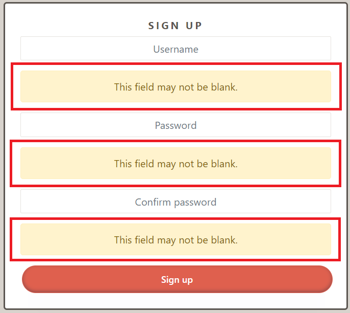

Non-matching Password Inputs:\
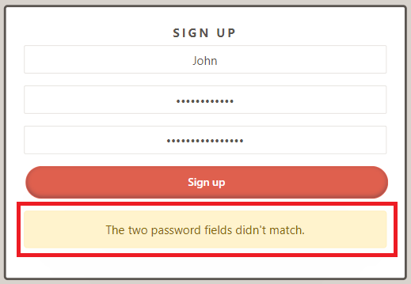

Password Complexity:\
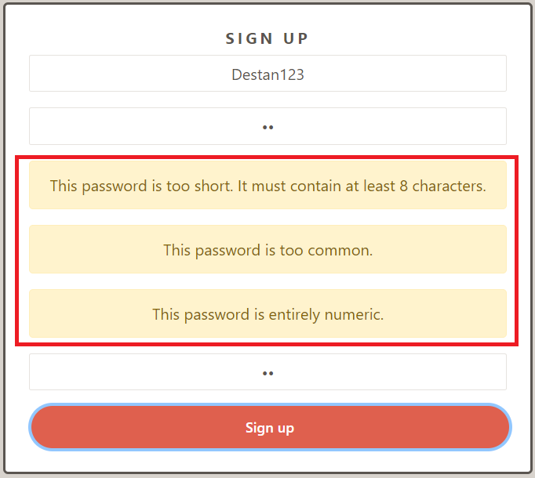

Existing Username:\
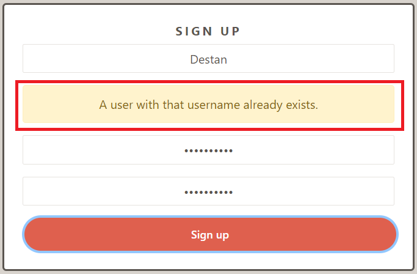

  <a href="#">Back to the top</a>

#### SignInForm

All following tests were performed on the SignInForm component in "src/pages/auth/SignInForm.js". To recreate the tests, navigate to the sign-in/login page and perform the following:

| Function                  | Test Instruction                                                                     | Expected Result                                                                      |   Pass   |
| :------------------------ | :----------------------------------------------------------------------------------- | :----------------------------------------------------------------------------------- | :------: |
| Valid Field Inputs        | Fill in the username and password fields with valid credentials and click "Sign in". | The user is signed in successfully and redirected to their profile page.             | &#10003; |
| Empty Field Inputs        | Leave the username and password fields blank and click "Sign in".                    | "This field may not be blank." error message is displayed.                           | &#10003; |
| Invalid Credentials       | Enter incorrect username and/or password and click "Sign in".                        | An error message stating "Unable to log in with provided credentials." is displayed. | &#10003; |
| Username Field Validation | Enter a non-existent username and a password, then click "Sign in".                  | An error message stating "Unable to log in with provided credentials" is displayed.  | &#10003; |
| Link to Sign Up           | Click the "Don't have an account? Sign up now!" link.                                | The user is redirected to the sign-up page.                                          | &#10003; |

Screenshots

Empty Field Inputs:\
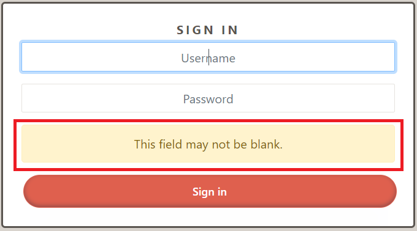

Invalid Credentials, Username Field Validation:\
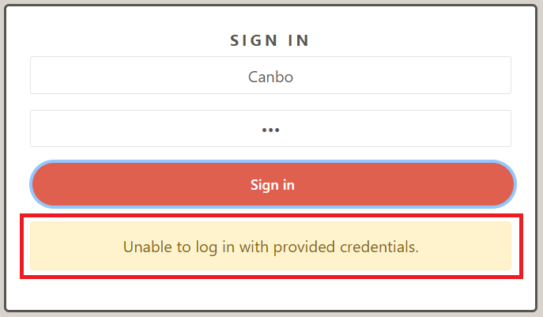

  <a href="#">Back to the top</a>

#### SpotifySearchPage

All following tests were performed on the SpotifySearchPage component in "src/spotify/SpotifySearchPage.js". To recreate the tests, navigate to the Spotify search page (bottom right of the navbar - Spotify icon) and perform the following:

| Function                         | Test Instruction                                                                                                                   | Expected Result                                                                                                                       |   Pass   |
| :------------------------------- | :--------------------------------------------------------------------------------------------------------------------------------- | :------------------------------------------------------------------------------------------------------------------------------------ | :------: |
| Spotify Authentication Modal     | With no access token stored in local storage, enter the Spotify search page.                                                       | A modal prompting for Spotify authentication appears.                                                                                 | &#10003; |
| Accepting Modal Prompt           | When the modal pops up, click "Confirm".                                                                                           | The user is redirected to the official Spotify login page.                                                                            | &#10003; |
| Authentication Success           | Complete the authentication process successfully.                                                                                  | The user is redirected back to the app with the ability to perform searches.                                                          | &#10003; |
| useSpotifyAuth Hook              | Upon being redirected back to the app, check the developer tools, and check for local storage.                                     | The useSpotifyAuth hook has stored the "code", "code_verifier", "access_token" and a "refresh_token" in local storage.                | &#10003; |
| Search                           | Enter a valid search query in the search bar and submit.                                                                           | Search results for albums, playlists, and artists matching the query are displayed.                                                   | &#10003; |
| Empty Search Field               | Attempt a search with an empty search field.                                                                                       | "Search field is empty" alert is displayed.                                                                                           | &#10003; |
| Search History                   | Perform a search, navigate away from the page, and then return.                                                                    | The last search results are loaded from local storage and displayed.                                                                  | &#10003; |
| Search History Upon Empty Search | Perform a search by inserting a "space", navigate away from the page, and then return.                                             | The last search results with just a "space" are not stored and your latest "legal" search is loaded from local storage and displayed. | &#10003; |
| Fresh Access Token               | After each search, check local storage for the access_token and refresh_token.                                                     | They both refresh with every successful search.                                                                                       | &#10003; |
| Spotify Player                   | Click on a search result.                                                                                                          | The Spotify player within the AccordionWindow component appears and ready to play the selected playlist.                              | &#10003; |
| Hide Spotify Player              | Click on a search result. Click on the downwards arrow on top of the Spotify player.                                               | The Spotify player minimizes downwards and is hidden.                                                                                 | &#10003; |
| Re-open Spotify Player           | Click on a search result. Click on the downwards arrow on top of the Spotify player, click the upward arrow just above the navbar. | The Spotify player expands again and displays the previously selected playlist.                                                       | &#10003; |
| Play Music                       | Click the play button within the player.                                                                                           | The selected playlist starts to play.                                                                                                 | &#10003; |
| Spotify Player Uri Context       | While the AccordionWindow is open, select another playlist and click on it.                                                        | The Spotify player's URI is updated and displays the newly selected playlist.                                                         | &#10003; |
| Add Playlist Button              | Click the "Add" button underneath any of the search results.                                                                       | A confirmation modal appears with the playlist information and an option to confirm the addition.                                     | &#10003; |
| Successful Playlist Addition     | Once confirmation modal has been confirmed, click your profile tab.                                                                | The playlist is be successfully added to your profile.                                                                                | &#10003; |
| Cancel Playlist Addition         | Click the "Add" button to prompt the confirmation modal, and click "Close".                                                        | The modal window closes without adding the playlist.                                                                                  | &#10003; |
| Local Storage/Sensitive Data     | Log out using the logout button in your profile, and check the local storage in developer tools.                                   | The access_token and refresh_token is deleted.                                                                                        | &#10003; |

Screenshots

Spotify Authentication Modal:\

Search:\
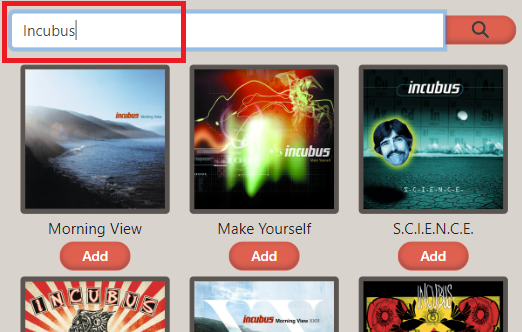

Empty Search Field:\
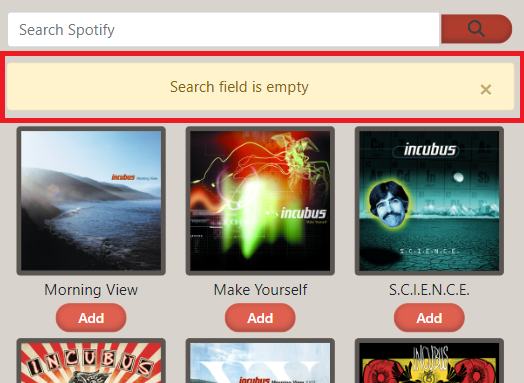

Spotify Player:\
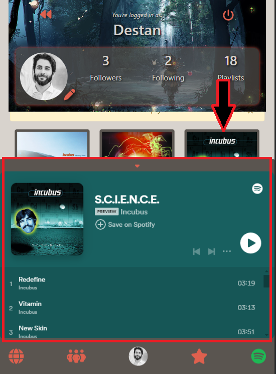

Re-open Spotify Player:\
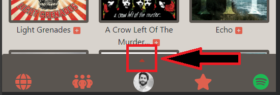

Add Playlist Button/Confirmation Modal:\
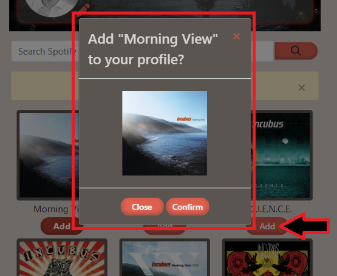

Successful Playlist Addition:\
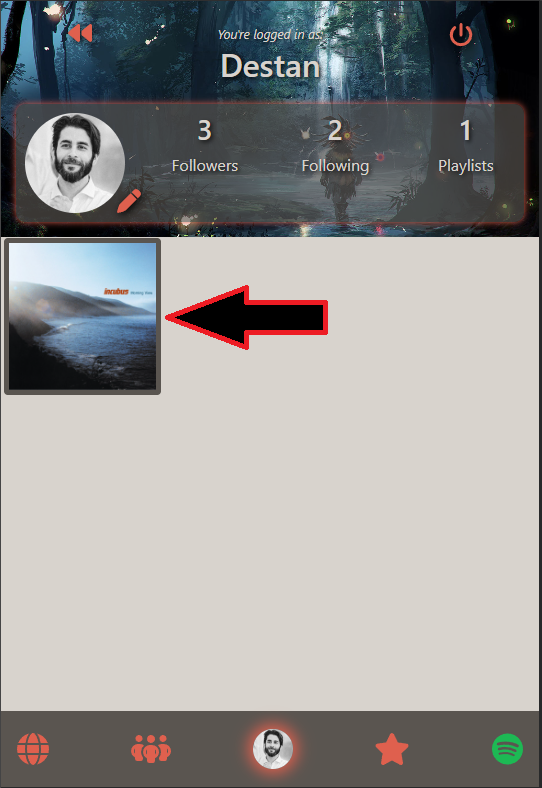

  <a href="#">Back to the top</a>

#### NavBar Component

All following tests were performed on the NavBar component in "src/components/NavBar.js". As the navbar is visible in every view of the application, you do not need to be anywhere specific (unless specified) in order to recreate these tests:

| Function                     | Test Instruction                                            | Expected Result                                                                                                                        |   Pass   |
| :--------------------------- | :---------------------------------------------------------- | :------------------------------------------------------------------------------------------------------------------------------------- | :------: |
| Display for Logged Out Users | Navigate to the application without being logged in.        | The navbar displays icons and links for Sign Up and Login only (top right of the page).                                                | &#10003; |
| Display for Logged In Users  | Log in with a user account.                                 | The navbar displays icons for Global, Followed User Feed, User Profile, User Rated Playlists, and Spotify Search (bottom of the page). | &#10003; |
| Profile Image Display        | Log in and observe the navbar's profile link.               | The navbar displays the current user's profile image if available; otherwise, a default avatar.                                        | &#10003; |
| Navigation Functionality     | Click on each navigation link while logged in.              | The application navigates to the corresponding page for each link without any errors.                                                  | &#10003; |
| Clicked Icon Visual Feedback | Click each navbar icon and observe the icon after clicking. | Selected icon turns to a darker shade, if profile is selected it has a faint glow around it.                                           | &#10003; |

Screenshots

Display for Logged Out Users:\
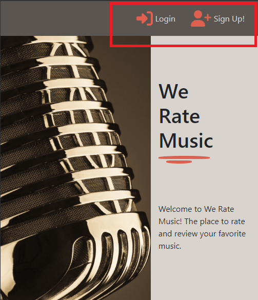

Display for Logged In Users/Profile Image Display:\
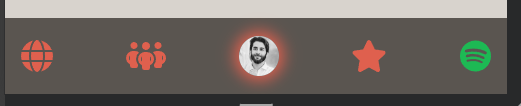

Clicked Icon Visual Feedback:\
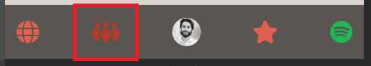

Clicked Icon Visual Feedback - Profile Glow:\
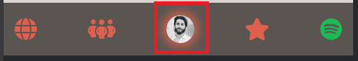

  <a href="#">Back to the top</a>

#### Profile

All following tests were performed on the Profile component in "src/components/Profile.js". To recreate the tests, navigate to the Profile page (bottom middle of the navbar - Profile picture icon) and perform the following:

| Function                          | Test Instruction                                                                                         | Expected Result                                                                                                                                                                                                       |   Pass   |
| :-------------------------------- | :------------------------------------------------------------------------------------------------------- | :-------------------------------------------------------------------------------------------------------------------------------------------------------------------------------------------------------------------- | :------: |
| Initial Load and Data Fetching    | Navigate to the Profile page for a specific user.                                                        | The LoadingSpinner is visible while user data is being fetched. Once data is loaded, the user's profile information, including avatar, followers count, following count, and playlists count, are displayed.          | &#10003; |
| Tooltips                          | Hover over the various icons in the profile container on the top of the page.                            | Tooltips appear beneath all of them <em>(see examples below)</em>.                                                                                                                                                    | &#10003; |
| Follow/Unfollow Functionality     | For profiles that the current user does not own, test the follow and unfollow buttons.                   | Clicking follow increases the followers count and changes the button to "Unfollow". Clicking "Unfollow" decreases the followers count and toggles the button back to "Follow".                                        | &#10003; |
| Edit Profile and Navigation       | Navigate to own profile. Click the "Edit" button.                                                        | Clicking the "Edit" button navigates the user to the profile edit page.                                                                                                                                               | &#10003; |
| Change Profile Image Button       | In edit mode, click "Change profile image".                                                              | The file manager opens up for selecting an image.                                                                                                                                                                     | &#10003; |
| Change Background Image Button    | In edit mode, click "Change background image".                                                           | The file manager opens up for selecting an image.                                                                                                                                                                     | &#10003; |
| Save Profile And Background Image | In edit mode, after selecting desired images, click "Save". Click on the profile button to refresh page. | The selected images replace the old profile images                                                                                                                                                                    | &#10003; |
| Back Navigation                   | Use the Back button to return to the previous page.                                                      | The Back button correctly navigates the user to the last visited page.                                                                                                                                                | &#10003; |
| Sign Out                          | Navigate to own profile page. Click the Sign Out Button.                                                 | A modal window appears, asking for confirmation to sign out. If "Confirm" is clicked, the user is signed out and redirected to homepage. If "Close" is clicked, the modal window closes without the user signing out. | &#10003; |

Screenshots

Tooltips:\
Back\
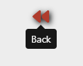

Edit - if user is profile owner:\
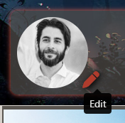

Follow/Unfollow - if user is not profile owner:\
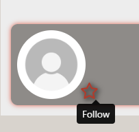
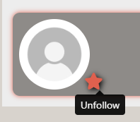

Sign Out:\
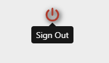

Follow/Unfollow Functionality:\
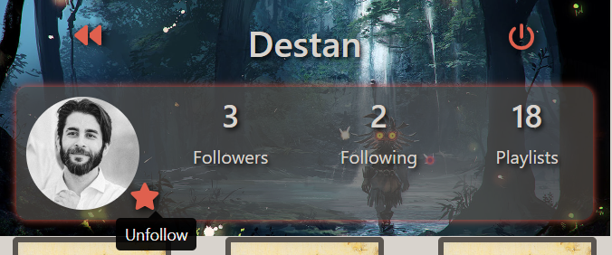

Edit Profile and Navigation:\
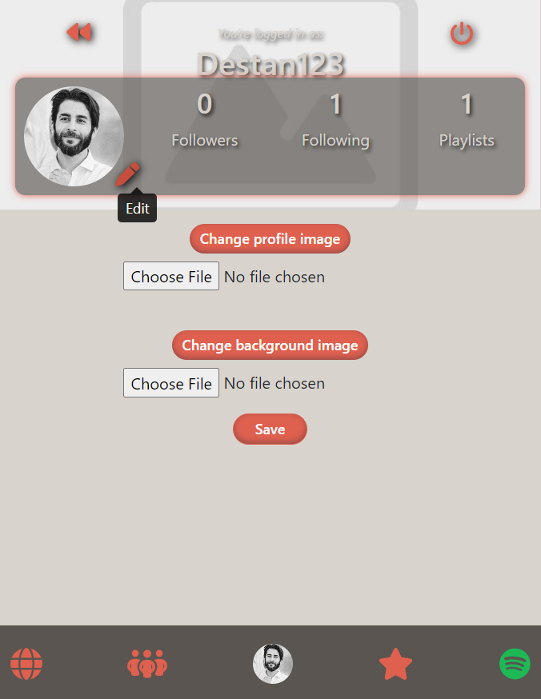

Back Navigation:\
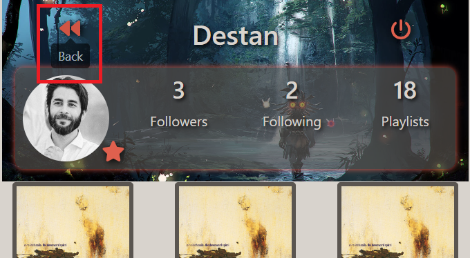

  <a href="#">Back to the top</a>

#### Playlist

All following tests were performed on the Playlist component in "src/components/Playlist.js".

| Function                          | Test Instruction                                                                                | Expected Result                                                                                          |   Pass   |
| :-------------------------------- | :---------------------------------------------------------------------------------------------- | :------------------------------------------------------------------------------------------------------- | :------: |
| Image Rendering with Provided URL | Render the Playlist component with a specified image URL.                                       | The specified image is displayed as the playlist's cover art.                                            | &#10003; |
| Fallback Image Rendering          | Render the Playlist component without specifying an image URL.                                  | The default image is displayed as the playlist's cover art.                                              | &#10003; |
| Alt Text Accuracy                 | Inspect the rendered image element for correct alt attribute.                                   | The alt text accurately describes the image as the playlist's cover art, including the playlist title.   | &#10003; |
| Playlist Positioning              | Search any artist.                                                                              | Each playlist is positioned in a neat grid fashion without any overlap.                                  | &#10003; |
| Playlist Page Scroll              | Search any artist. Scroll down.                                                                 | The playlists on the top start to disappear behind the profile section based on the scroll amount        | &#10003; |
| Playlist Edit Button              | Click on a playlist and click the "Edit Playlist" button.                                       | The playlist edit form is displayed.                                                                     | &#10003; |
| Playlist Edit                     | In the playlist edit form, edit the title and description. Click "Save".                        | The playlist title and description is updated.                                                           | &#10003; |
| Remove Playlist                   | In the playlist edit form, click the delete button.                                             | The playlist is removed from the users profile.                                                          | &#10003; |
| Listen To Playlist                | Click on a playlist and click the "click here.. ..have a listen!" button with the Spotify icon. | The Spotify player within the AccordionWindow component appears and ready to play the selected playlist. | &#10003; |

  <a href="#">Back to the top</a>

#### StarRating

All following tests were performed on the StarRating component in "src/components/StarRating.js".

| Function               | Test Instruction                                                                                | Expected Result                                                                                                                        |   Pass   |
| :--------------------- | :---------------------------------------------------------------------------------------------- | :------------------------------------------------------------------------------------------------------------------------------------- | :------: |
| Initial Rating Display | Click a playlist that already has a rating.                                                     | The initial rating matches the playlist's current rating.                                                                              | &#10003; |
| Add New Rating         | For a playlist without a previous rating, select a star rating.                                 | A new rating is posted to the API, updating the playlist's average rating and rating count. The selected rating is reflected visually. | &#10003; |
| Update Existing Rating | For a playlist with an existing rating, change the rating by selecting a different star rating. | The existing rating is updated via API, modifying the playlist's average rating accordingly. The updated rating is shown.              | &#10003; |
| Visual Feedback        | Interact with the rating component by adding or changing a rating.                              | Visual feedback is immediate, with the selected stars filled in to represent the rating.                                               | &#10003; |

  <a href="#">Back to the top</a>

#### FeedbackCreateForm

All following tests were performed on the FeedbackCreateForm component in "src/forms/FeedbackCreateForm.js".

| Function                      | Test Instruction                                                                                | Expected Result                                                           |   Pass   |
| :---------------------------- | :---------------------------------------------------------------------------------------------- | :------------------------------------------------------------------------ | :------: |
| User Feedback Button          | Navigate to own user profile page. Click the speech bubble on the top right of the user avatar. | The user feedback form is displayed                                       | &#10003; |
| User Feedback Submission      | Fill in the title, feedback description and add a optional image. Click "Submit".               | The user feedback is submitted to the developer successfully.             | &#10003; |
| User Feedback Form Validation | Leave the title, feedback description blank. Click "Submit".                                    | "This field may not be blank." error message is displayed.                | &#10003; |
| User Feedback Cancel          | Fill in the feedback form and click "Cancel".                                                   | The user is redirected to the profile page and the form is not submitted. | &#10003; |

  <a href="#">Back to the top</a>

## Validation

### HTML Validation

[The W3C Markup Validation Service](https://validator.w3.org/) was used to validate the HTML of the app. The following pages were tested:

- /: &#10003;\
  [Results](https://validator.w3.org/nu/?doc=https%3A%2F%2Fwe-rate-music-react-f931068bb6db.herokuapp.com%2F)
- /signin: &#10003;\
  [Results](https://validator.w3.org/nu/?doc=https%3A%2F%2Fwe-rate-music-react-f931068bb6db.herokuapp.com%2Fsignin)
- /signup: &#10003;\
  [Results](https://validator.w3.org/nu/?doc=https%3A%2F%2Fwe-rate-music-react-f931068bb6db.herokuapp.com%2Fsignup)
- /global: &#10003;\
  [Results](https://validator.w3.org/nu/?doc=https%3A%2F%2Fwe-rate-music-react-f931068bb6db.herokuapp.com%2Fglobal)
- /feed: &#10003;\
  [Results](https://validator.w3.org/nu/?doc=https%3A%2F%2Fwe-rate-music-react-f931068bb6db.herokuapp.com%2Ffeed)
- /profile/9: &#10003;\
  [Results](https://validator.w3.org/nu/?doc=https%3A%2F%2Fwe-rate-music-react-f931068bb6db.herokuapp.com%2Fprofile%2F9)
- /profile/9/edit: &#10003;\
  [Results](https://validator.w3.org/nu/?doc=https%3A%2F%2Fwe-rate-music-react-f931068bb6db.herokuapp.com%2Fprofile%2F9%2Fedit)
- /rated-playlists: &#10003;\
  [Results](https://validator.w3.org/nu/?doc=https%3A%2F%2Fwe-rate-music-react-f931068bb6db.herokuapp.com%2Frated-playlists)
- /playlist/31: &#10003;\
  [Results](https://validator.w3.org/nu/?doc=https%3A%2F%2Fwe-rate-music-react-f931068bb6db.herokuapp.com%2Fplaylist%2F31)
- /playlist/31/edit: &#10003;\
  [Results](https://validator.w3.org/nu/?doc=https%3A%2F%2Fwe-rate-music-react-f931068bb6db.herokuapp.com%2Fplaylist%2F31)
- /spotify-search: &#10003;\
  [Results](https://validator.w3.org/nu/?doc=https%3A%2F%2Fwe-rate-music-react-f931068bb6db.herokuapp.com%2Fspotify-search)
- /feedback/create: &#10003;\
  [Results](https://validator.w3.org/nu/?doc=https%3A%2F%2Fwe-rate-music-react-f931068bb6db.herokuapp.com%2Ffeedback%2Fcreate)

  <a href="#">Back to the top</a>

### CSS Validation

[The W3C CSS Validation Service](https://jigsaw.w3.org/css-validator/) was used to validate the CSS of the app. The following .css files were tested:

- AccordionWindow.module.css: &#10003;
- Avatar.module.css: &#10003;
- Button.module.css: &#10003;
- EditCreateForms.module.css: &#10003;
- Homepage.module.css: &#10003;
- LoadingSpinner.module.css: &#10003;
- ModalWindow.module.css: &#10003;
- NavBar.module.css: &#10003;
- Playlist.module.css: &#10003;
- PlaylistDetail.module.css: &#10003;
- PlaylistsPage.module.css: &#10003;
- Profile.module.css: &#10003;
- SearchBar.module.css: &#10003;
- SignInUpForm.module.css: &#10003;
- SignOutButton.module.css: &#10003;
- SpotifySearchPage.module.css: &#10003;

All .css are validated as CSS level 3 + SVG.

  <a href="#">Back to the top</a>

