# We Rate Music

## Testing The React Frontend

### Tested Devices

The app was tested on the following devices:

- Lenovo Legion Y520 15" laptop (Windows 10)

### Tested Browsers

- Google Chrome (121.0.6167.162 - 64-bit)

### Manual Testing

Each component and feature was manually tested. The tests in this section are categorised by the file that they live in. If any files seem to be missing from this section, it is because the testing was likely done in conjunction with another component, this will be mentioned in the test descriptions.

#### SignUpForm

All following tests were performed on the SignUpForm component in "src/pages/auth/SignUpForm.js". To recreate the tests, navigate to the sign-up page and perform the following:

| Function | Test Instruction | Expected Result | Pass |
| :------- | :--------------- | :-------------- | :--: |
| Valid Field Inputs | Fill in the username, password, and confirm password fields and click "Sign up". | An account is created successfully, and the user is redirected to the sign-in page. | &#10003; |
| Empty Field Inputs | Leave the username, password, and confirm password fields blank and click "Sign up". | "This field may not be blank." error message is displayed under all empty fields. | &#10003; |
| Non-matching Password Inputs | Fill in the username and password. Fill in a different password for the confirm password field and click "Sign up". | An error message stating that the passwords do not match will be displayed. | &#10003; |
| Password Complexity | Enter matching passwords that do not meet the complexity requirements and fill in the other fields correctly. Click "Sign up". | Various error messages displayed stating the issue with the given password <em>(see examples in screenshot below)</em> | &#10003; |
| Existing Username | Enter a username that already exists, fill in the other fields correctly, and click "Sign up". | An error message stating "A user with that username already exists." will be displayed. | &#10003; |

Screenshots

Empty Field Inputs:\
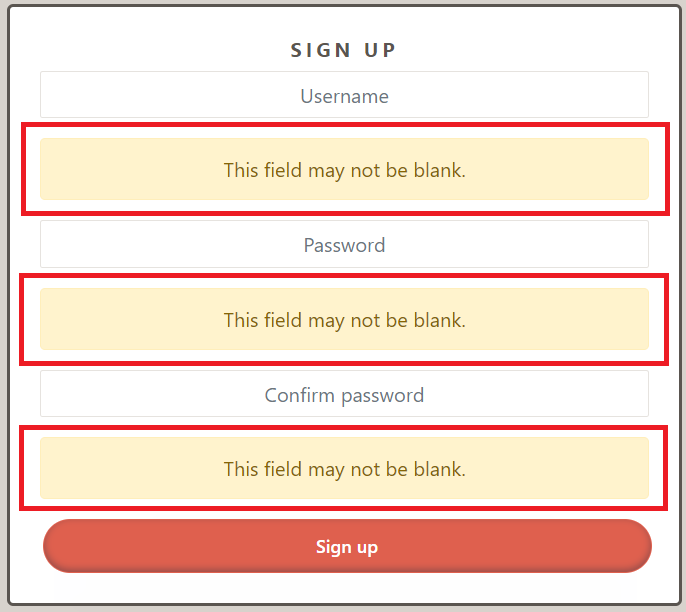

Non-matching Password Inputs:\
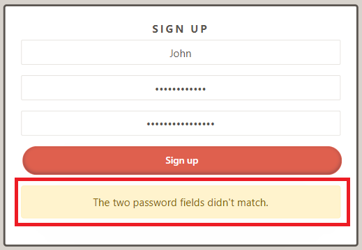

Password Complexity:\
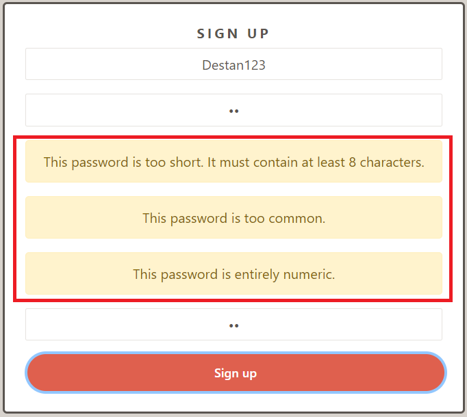

Existing Username:\
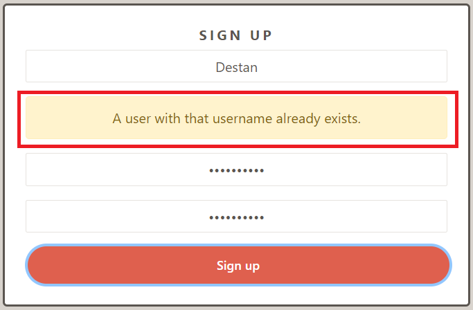

#### SignInForm

All following tests were performed on the SignInForm component in "src/pages/auth/SignInForm.js". To recreate the tests, navigate to the sign-in/login page and perform the following:

| Function | Test Instruction | Expected Result | Pass |
| :------- | :--------------- | :-------------- | :--: |
| Valid Field Inputs | Fill in the username and password fields with valid credentials and click "Sign in". | The user will be signed in successfully and redirected to their profile page. | &#10003; |
| Empty Field Inputs | Leave the username and password fields blank and click "Sign in". | "This field may not be blank." error message is displayed. | &#10003; |
| Invalid Credentials | Enter incorrect username and/or password and click "Sign | An error message stating "Unable to log in with provided credentials." will be displayed. | &#10003; |
| Username Field Validation | Enter a non-existent username and a password, then click "Sign in". | An error message stating "Unable to log in with provided credentials" will be displayed. | &#10003; |
| Link to Sign Up | click the "Don't have an account? Sign up now!" link. | The user will be redirected to the sign-up page. | &#10003; |

Screenshots

Empty Field Inputs:\
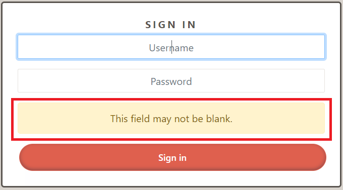

Invalid Credentials, Username Field Validation:\
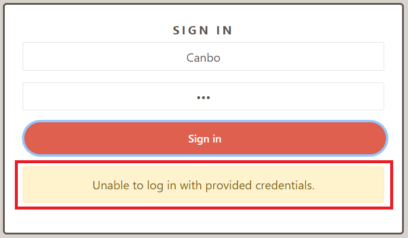

#### SpotifySearchPage

All following tests were performed on the SpotifySearchPage component in "src/spotify/SpotifySearchPage.js". To recreate the tests, navigate to the Spotify search page (bottom right of the navbar - Spotify icon) and perform the following:

| Function | Test Instruction | Expected Result | Pass |
| :------- | :--------------- | :-------------- | :--: |
| Spotify Authentication Modal | With no access token stored in local storage, enter the Spotify search page. | A modal prompting for Spotify authentication will appear. | &#10003; |
| Accepting Modal Prompt | When the modal pops up, click "Confirm" | The user will be redirected to the official Spotify login page | &#10003; |
| Authentication Success | Complete the authentication process successfully. | The user will be redirected back to the app with the ability to perform searches. | &#10003; |
| useSpotifyAuth Hook | Upon being redirected back to the app, check the developer tools, and check for local storage. | The useSpotifyAuth hook will have stored the "code", "code_verifier", "access_token" and a "refresh_token" in local storage. | &#10003; |

| Search | Enter a valid search query in the search bar and submit. | Search results for albums, playlists, and artists matching the query will be displayed. | &#10003; |
| Empty Search Field | Attempt a search with an empty search field. | "Search field is empty" alert is displayed. | &#10003; |
| Search History | Perform a search, navigate away from the page, and then return. | The last search results will be loaded from local storage and displayed. | &#10003; |
| Search History Upon Empty Search | Perform a search by inserting a "space", navigate away from the page, and then return. | The last search results with just a "space" will not be stored and your latest "legal" search will be loaded from local storage and displayed. | &#10003; |
| Fresh Access Token | After each search, check local storage for the access_token and refresh_token. | They will both refresh with every successful search | &#10003; |

| Spotify Player | Click on a search result. | The Spotify player within the AccordionWindow component will appear ready to play the selected playlist. | &#10003; |
| Hide Spotify Player | Click on a search result. Click on the downwards arrow on top of the Spotify player | The Spotify player will minimize downwards and be hidden. | &#10003; |
| Re-open Spotify Player | Click on a search result. Click on the downwards arrow on top of the Spotify player, click the upward arrow just above the navbar. | The Spotify player will expand again display the previously selected playlist. | &#10003; |
| Play Music | Click the play button within the player | The selected playlist will start to play | &#10003; |
| Spotify Player Uri Context | While the AccordionWindow is open, select another playlist and click on it. | The Spotify player's URI will have updated and will display the newly selected playlist. | &#10003; |

| Add Playlist Button | Click the "Add" button underneath any of the search results. | A confirmation modal will appear with the playlist information and an option to confirm the addition. | &#10003; |
| Successful Playlist Addition | Once confirmation modal has been confirmed, click your profile tab. | The playlist will be successfully added to your profile. | &#10003; |
| Cancel Playlist Addition | Click the "Add" button to prompt the confirmation modal, and click "Close". | The modal window will close without adding the playlist. | &#10003; |

| Local Storage/Sensitive Data | Log out using the logout button in your profile, and check the local storage in developer tools | The access_token and refresh_token will be deleted | ? |

Screenshots

Spotify Authentication Modal:\
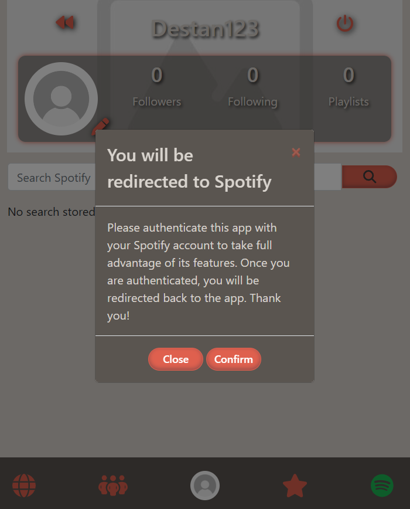

Search:\
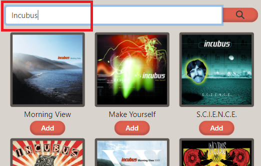

Empty Search Field:\
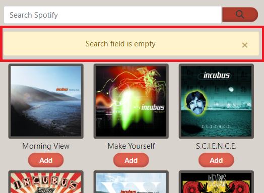

Spotify Player:\
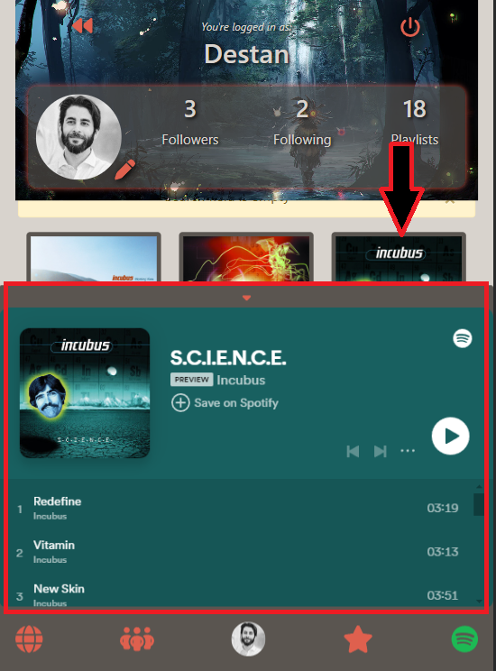

Re-open Spotify Player:\
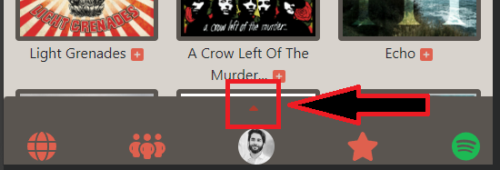

Add Playlist Button/Confirmation Modal:\
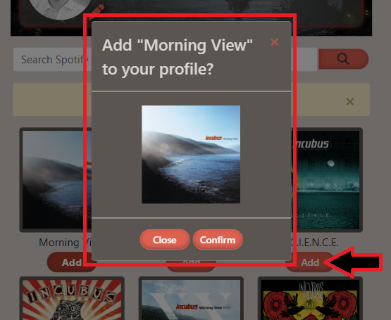

Successful Playlist Addition:\
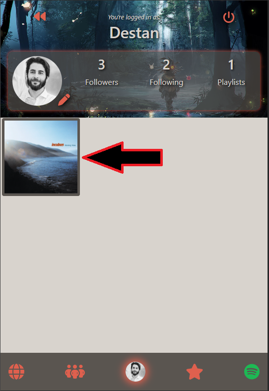

#### NavBar Component

All following tests were performed on the NavBar component in "src/components/NavBar.js". As the navbar is visible in every view of the application, you do not need to be anywhere specific (unless specified) in order to recreate these tests:

| Function | Test Instruction | Expected Result | Pass |
| :------- | :--------------- | :-------------- | :--: |
| Display for Logged Out Users | Navigate to the application without being logged in. | The navbar will display icons and links for Sign Up and Login only (top right of the page). | &#10003; |
| Display for Logged In Users | Log in with a user account. | The navbar will display icons for Global, Followed User Feed, User Profile, User Rated Playlists, and Spotify Search (bottom of the page). | &#10003; |
| Profile Image Display | Log in and observe the navbar's profile link. | The navbar will display the current user's profile image if available; otherwise, a default avatar. | &#10003; |
| Navigation Functionality | Click on each navigation link while logged in. | The application will navigate to the corresponding page for each link without any errors. | &#10003; |
| Clicked Icon Visual Feedback | Click each navbar icon and observe the icon after clicking | Selected icon will be a darker shade, if profile is selected it will have a faint glow around it  | &#10003; |

Screenshots

Display for Logged Out Users:\

Display for Logged In Users/Profile Image Display:\

Clicked Icon Visual Feedback:\

Clicked Icon Visual Feedback - Profile Glow:\

#### Profile

| Function | Test Instruction | Expected Result | Pass |
| :------- | :--------------- | :-------------- | :--: |
| Initial Load and Data Fetching | Navigate to the Profile page for a specific user. | The LoadingSpinner will be visible while user data is being fetched. Once data is loaded, the user's profile information, including avatar, followers count, following count, and playlists count, will be displayed. | &#10003; |
| Tooltips | Hover over the various icons in the profile container on the top of the page.  | Tooltips will appear beneath all of them <em>(see examples below)</em>. | &#10003; |
| Follow/Unfollow Functionality | For profiles that the current user does not own, test the follow and unfollow buttons. | Clicking follow will increase the followers count and change the button to "Unfollow". Clicking "Unfollow" will decrease the followers count and toggle the button back to "Follow". | &#10003; |
| Edit Profile and Navigation | If the current user views their own profile, the "Edit" button will be visible. | Clicking the "Edit" button will navigate the user to the profile edit page. | &#10003; |
| Change Profile Image Button | In edit mode, click "Change profile image". | The file manager will open up for selecting an image | &#10003; |
| Change Background Image Button | In edit mode, click "Change background image". | The file manager will open up for selecting an image | &#10003; |
| Save Profile And Background Image | In edit mode, after selecting desired images, click "Save". Click on the profile button to refresh page | The selected images will replace the old profile images | &#10003; |
| Back Navigation | Use the Back button to return to the previous page. | The Back button will correctly navigate the user to the last visited page. | &#10003; |

Screenshots

Tooltips:\
Back\

Edit - if user is profile owner\

Follow/Unfollow - if user is not profile owner\

Sign Out\

Follow/Unfollow Functionality:\

Edit Profile and Navigation:\

Back Navigation:\

